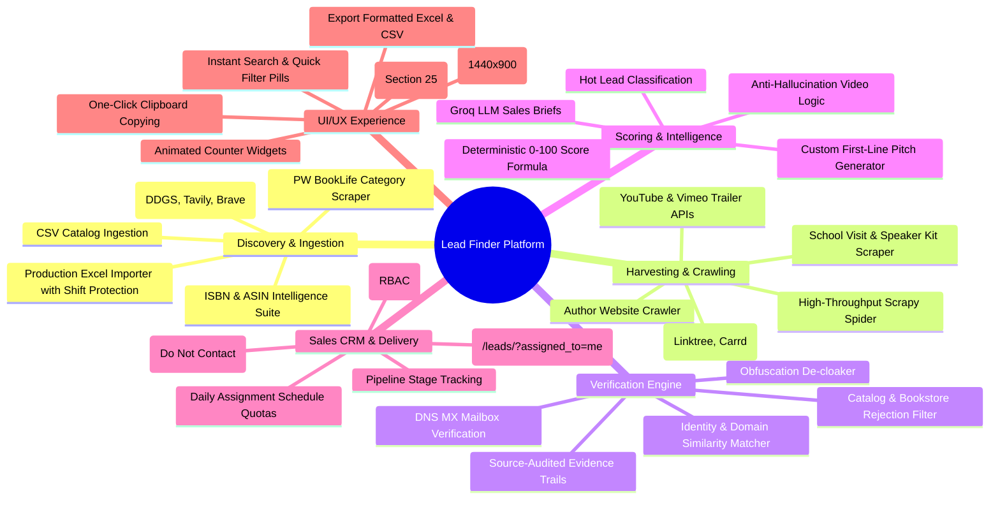

# ⚡ Features & Capabilities Specification

This document provides an exhaustive breakdown of every feature, component, and subsystem built into the **Book Trailer Lead Finder** application.

---

## 📑 Feature Inventory Matrix

---

## 1. Discovery & Ingestion Features

### 1.1 Multi-Provider Search Engine
* **No-Key Free Default:** Implements DuckDuckGo Search (`ddgs`) as the primary zero-cost discovery mechanism.
* **Commercial Search Connectors:** Optional integration with Tavily Search API (`tavily-python`) and Brave Search API for high-volume enterprise discovery.
* **Public Search-Index Safety:** Discovers public Amazon book listing URLs through search engine indices without directly querying or scraping Amazon product pages.

### 1.2 PW BookLife Category Crawler
* **Category Scraping:** Direct harvesting of self-published and indie children's books from Publishers Weekly BookLife category listings (`run_booklife_research`).
* **Age Filter Targeting:** Targets specific age ranges (e.g. `children-young-adult`) to ensure only relevant picture books enter the funnel.

### 1.3 Production Excel Ingestion (`import_excel_leads`)
* **Dual-Workbook Ingestion:** Ingests complex multi-column workbooks such as `leads data.xlsx` (1,038 rows) and `leads dev-ali.xlsx` (605 rows).
* **Automated Column-Shift Recovery:**
  * Detects when an author name has been shifted into the Phone column and automatically swaps it back while discarding the bogus contact record.
  * Recovers email addresses misplaced in the `Email Proof URL` column when the primary `Email` column was left blank.
* **Clean Date Parser:** Automatically extracts standardized `YYYY-MM-DD` publication dates from verbose narrative strings (e.g. converting *"Fresh September 18, 2026 release coverage..."* into `2026-09-18`).
* **ASIN Deduplication:** Matches incoming records against existing database ASINs, enriching existing records rather than creating duplicates.

### 1.4 ISBN & ASIN Intelligence Suite
* **Triple-Checksum Mathematical Validation:**
  * ISBN-10 Modulo-11 with 'X' support.
  * ISBN-13 Modulo-10 EAN algorithm.
  * Amazon ASIN alphanumeric structure validation.
* **Bidirectional Identifier Conversion:** Converts valid ISBN-10 to equivalent ISBN-13 (adding `978` prefix and recomputing checksum) and vice versa.
* **Multi-Catalog Reconciliation:** Queries Open Library API and Google Books API simultaneously to verify title, author, publisher, and page count.
* **Dynamic SVG Barcode Generation:** Programmatically generates official vector EAN-13 barcodes (`/isbn-search/barcode/<identifier>.svg`) using `python-barcode`.

---

## 2. Web Harvesting & Crawling Features

### 2.1 Deep Author Website Crawler
* **Direct Harvesting:** Scrapes author-owned domains and portfolio sites for visible contact coordinates (`harvest_author_site_leads`).
* **Politeness Bounds:** Strictly adheres to `robots.txt`, caps crawl depth to 4 pages per site, enforces request timeouts, and applies customizable delays (`--sleep`).

### 2.2 Bounded Bio-Link Crawler
* **Single-Pass Bio Crawling:** Inspects verified public profiles on supported bio-link aggregators:
  * **Linktree** (`linktr.ee/<username>`)
  * **Carrd** (`*.carrd.co`)
  * **Substack** (`*.substack.com`)
* **Strict Limits:** Caps bio-link inspection to 5 pages per profile, preventing crawling rabbit holes.

### 2.3 School Visit & Speaker Kit Scraper
* **Presentation Mining:** Crawls school presentation, author booking, and media kit pages (`scrape_author_visit_leads`), where children's authors routinely publish direct booking emails and representation details.

### 2.4 Asynchronous Scrapy Integration
* **High-Throughput Spiders:** Optional asynchronous Scrapy engine (`scrape_scrapy_author_batches`) for concurrent crawling of high-volume author batches.

---

## 3. Contact Verification Engine Features

### 3.1 Obfuscation De-cloaking
* **Regex Pattern Resolution:** Decodes common email masking strategies:
  * `name [at] domain (dot) com` ➔ `name@domain.com`
  * `mailto:%6E%61%6D%65%40...` (URL encoded) ➔ `name@domain...`
  * Cloudflare email protection tags (`data-cfemail`) ➔ clean plaintext address.
  * HTML character entity strings (`&#64;`, `&#46;`).

### 3.2 Catalog & Bookstore Rejection Filter
* **False-Positive Suppression:** Automatically rejects contact addresses originating from:
  * Open Library (`openlibrary.org`)
  * Goodreads (`goodreads.com`)
  * University presses (e.g. `mit.edu`, `oxford.edu`)
  * Commercial retailers (`barnesandnoble.com`, `target.com`)
* **Agency Exception Rule:** Retains literary agents (`representation_email`) and PR publicists (`publicist_email`) even when located on third-party domains.

### 3.3 Author Identity & Domain Alignment
* **Similarity Ratios:** Evaluates author name against domain name, page titles, and meta descriptions using Levenshtein distance and token-sort ratios.
* **Impostor Prevention:** Penalizes candidates where the domain name conflicts with the book author's registered name.

### 3.4 Asynchronous DNS MX Verification
* **Mailbox Acceptance:** Queries DNS MX records (`dnspython`) to ensure the domain accepts inbound SMTP connections, flagging dead domains.

---

## 4. Scoring, AI Briefs & Anti-Hallucination Features

### 4.1 Deterministic 0–100 Lead Scoring
* **Mathematical Formula:** Computes final lead score from:
  $$\text{Score} = \text{Book Fit (35)} + \text{Contactability (35)} + \text{Video Opportunity (20)} + \text{Data Quality (10)}$$
* **Hot Lead Badge:** Leads scoring $\ge 75$ with verified email and no existing trailer receive the prominent green hot-row border.

### 4.2 Anti-Hallucination Video Logic
* **Safe Language Standard:** When no trailer is found, the system explicitly states:
  > *"No public video found in searched sources."*
* **Video Differentiation:** Distinguishes amateur cellphone read-alouds and school webinars from professionally produced 2D/3D animated book trailers.

### 4.3 AI Sales Pitch Generator
* **Groq LLM Integration:** Synthesizes book summaries, genre themes, and visual elements to produce:
  * **Sales Hook:** Why this book is an ideal fit for animation.
  * **Custom First Line:** Engaging opener personalized to the author's plot and characters.
  * **Compliance Warnings:** Clear guardrails warning sales reps against negative framing.
* **Offline Fallback Engine:** Features deterministic template-based generation if Groq API is unavailable or disabled (`--no-ai`).

---

## 5. Sales CRM & Workflow Features

### 5.1 Role-Based Access Control (RBAC)
* **Superadmin:** Full administrative control, system settings, user provisioning, suppression list management.
* **Manager:** Create research runs, configure scheduled hunts, assign lead quotas to reps, view team analytics.
* **Sales Rep:** Restricted to their private assigned leads queue (`/leads/?assigned_to=me`), status transitions, and pitch copy.

### 5.2 Automated Quota Distribution (`LeadAssignmentSchedule`)
* **Daily Quota Schedules:** Automatically distributes $N$ verified leads per weekday to designated sales reps.
* **Atomic Transaction Locks:** Allocates leads inside atomic transactions, preventing race conditions or double-assignment.

### 5.3 Pipeline Stage Management
* **Progress Tracking:** Tracks leads across 6 standard stages:
  1. `Pending`
  2. `In Progress`
  3. `Contacted`
  4. `Meeting Booked`
  5. `Closed Won`
  6. `Lost / Passed`

### 5.4 Suppression List (`DoNotContact`)
* **One-Click Opt-Out:** Instantly adds authors and domains to a permanent suppression table, blocking them from all future crawler runs and export sheets.

---

## 6. Background Scheduler Daemon Features

### 6.1 Continuous Polling Worker
* **Daemon Execution:** `run_scheduler_loop --daemon --check-interval 60` continuously checks for due research tasks.
* **Cadence Options:** Interval (every $X$ hours), Daily, Weekly (specific weekday), or Specific Days (e.g. Mon, Wed, Fri).

### 6.2 Stale Lease Recovery
* **Self-Healing Architecture:** Tasks left in `running` state by unexpected server reboots or crashed worker processes are automatically reclaimed after `APP_SCHEDULED_TASK_LEASE_SECONDS` (default: 6 hours).

---

## 7. UI/UX Glassmorphic Experience Features

### 7.1 Desktop-Optimized 7-Column Table
* **Screen Optimization:** Tailored for 1440×900 desktop and laptop screens with zero horizontal scroll:
  * Checkbox (`38px`)
  * Book Details (`32%`)
  * Author & Contact (`27%`)
  * Channels (`11%`)
  * Published (`10%`)
  * Task (`11%`)
  * Actions (`9%`)
* **2-Line Title Clamp:** Truncates book titles cleanly with `-webkit-line-clamp: 2` and full title tooltip.

### 7.2 Stacking Context & Z-Index Dropdown Elevation (Section 25)
* **Zero Element Bleed:** Table rows do not retain `transform` properties after entrance animations, preventing rogue Stacking Contexts.
* **Active Elevation:** Dynamically elevates active dropdown rows and cells to `z-index: 1050 !important;` and menus to `z-index: 1070 !important;`.
* **Opacity-Only Animations:** Dropdown animations transition only `opacity`, leaving Popper's translation coordinates intact.

### 7.3 Productivity Accelerators
* **One-Click Clipboard Copying:** Copies author email addresses directly to clipboard with instant visual feedback.
* **Quick Filter Pills:** Instant filtering for `Verified Ready`, `Verified Email`, `Verified Phone`, `No Video`, and `Needs Review`.
* **Animated Counter Widgets:** Real-time numerical roll-up counters for dashboard KPI cards.

---

## 8. Multi-Format Export Features

### 8.1 Instant CSV Streaming
* Streams filtered leads directly to CSV with UTF-8 encoding, complete with source audit URLs and confidence ratings.

### 8.2 Formatted Multi-Sheet Excel Workbook
* Generates `.xlsx` spreadsheets featuring styled headers, auto-fit column widths, clickable hyperlinks, and separated contact sheets.
