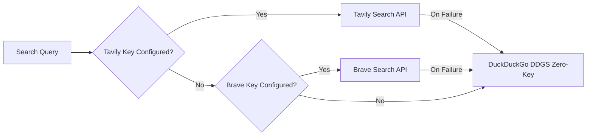
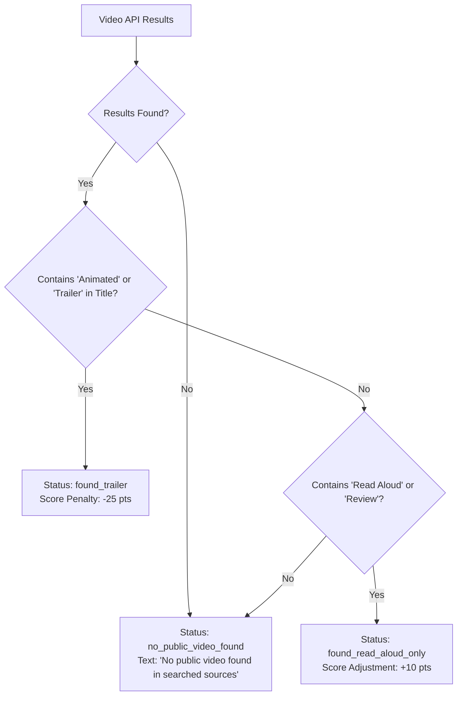

# 🧠 Master Execution Logic: A to Z (LOGIC_A_TO_Z.md)

This document provides an exhaustive, phase-by-phase technical reference for every algorithm, heuristic, regular expression, validation rule, and state transition implemented in the **Book Trailer Lead Finder** application.

---

## 🔤 Operational Phase Map (A to Z)

```text
[A] Ingestion & Input Normalization ➔ [B] Query Planning & Expansion ➔ [C] Amazon Search & ASIN Indexing
 ➔ [D] Website & Bio-Link Harvesting ➔ [E] Video Trailer Detection ➔ [F] Contact De-cloaking
 ➔ [G] Catalog & Bookstore Filter ➔ [H] Author Identity Matching ➔ [I] Network Deliverability Audit
 ➔ [J] Deterministic Lead Scoring ➔ [K] AI Pitch Hook Synthesis ➔ [L] Sales CRM & Quotas
 ➔ [M] 7-Column Layout & Stacking ➔ [N] Multi-Format Exports ➔ [Z] Suppression & Opt-Out
```

---

## [Phase A] Ingestion & Input Normalization

### 1. Header Recognition & Mapping
Incoming spreadsheets (`leads data.xlsx`, `leads dev-ali.xlsx`, CSV) are mapped against canonical field dictionaries:
```python
HEADER_MAPPINGS = {
    "title": ["book name", "book title", "book / project", "title"],
    "author": ["author / owner name", "author name", "author", "author / owner"],
    "amazon_url": ["amazon book / author url", "amazon url", "amazon link"],
    "category": ["category", "genre", "subgenre"],
    "phone": ["phone", "phone number", "direct phone"],
    "email": ["email", "primary email", "author email"],
    "email_proof": ["email proof url", "email source", "email proof"],
    "pub_date": ["publication date", "release date", "published"],
}
```

### 2. Anomaly Detection & Column-Shift Recovery
Spreadsheets frequently exhibit column misalignments. The parser evaluates:
* **Author in Phone Column:** If `Author` contains strings matching `r"children|verified|page|book|illustrated"` and `Phone` contains alphabetic characters without digits:
  ```python
  if is_descriptive(author_raw) and not has_digits(phone_raw):
      author_name = phone_raw
      phone_raw = ""
  ```
* **Email in Proof URL:** If `Email` is empty and `Email Proof URL` matches `r"^[^@\s]+@[^@\s]+\.[^@\s]+$"` without `http`:
  ```python
  if not email_raw and "@" in email_proof_url and not email_proof_url.startswith("http"):
      email_raw = email_proof_url
      email_proof_url = phone_proof_url
  ```

### 3. Publication Date Regularization
Extracts clean dates from verbose narrative strings:
```python
DATE_REGEX = re.compile(r'\b(20\d{2}[-/]\d{1,2}[-/]\d{1,2})\b')
# Matches "Fresh September 18, 2026 release coverage..." -> "2026-09-18"
```

---

## [Phase B] Query Planning & Search Expansion

### 1. Keyword Token Formulation
Input queries are tokenized and augmented with high-intent children's book indicators:
* Core Tokens: `children's book`, `picture book`, `illustrated`, `bedtime story`, `kids book`.
* Search Query Format: `"<keyword>" site:amazon.com/dp/ OR site:amazon.com/*/dp/`

### 2. Multi-Provider Fallback Routing


---

## [Phase C] Amazon Search & ASIN Indexing

### 1. ASIN Extraction Algorithm
Validates and extracts standard 10-character Amazon Standard Identification Numbers:
```python
ASIN_REGEX = re.compile(r'/(?:dp|gp/product|exec/obidos/ASIN)/([A-Z0-9]{10})', re.IGNORECASE)
```
* Amazon URLs are normalized to canonical format: `https://www.amazon.com/dp/<ASIN>`.
* Affiliate tracking tags (`tag=`, `ref=`, `linkCode=`) are stripped.

---

## [Phase D] Website & Bio-Link Harvesting

### 1. Official Author Website Discovery
Queries public search engines: `"<Author Name>" "<Book Title>" official website OR contact OR about`.

### 2. Politeness & Bounded Crawling Limits
* **Maximum Crawl Depth:** 4 internal pages per author website.
* **Timeout:** 10 seconds per HTTP request.
* **Politeness Delay:** Configurable sleep interval (`0.15s` to `0.5s`).
* **Supported Bio-Link Hubs:**
  * Linktree (`linktr.ee/<user>`)
  * Carrd (`*.carrd.co`)
  * Substack (`*.substack.com`)
* **Bio-Link Cap:** Maximum 5 outbound pages per social profile.

---

## [Phase E] Video Trailer Detection & Anti-Hallucination Classification

### 1. Querying Video Endpoints
Queries YouTube Data API and Vimeo search endpoints for: `"<Author Name>" "<Book Title>" book trailer`.

### 2. Anti-Hallucination Safe Status Logic


---

## [Phase F] Contact Obfuscation De-cloaking

The extraction engine resolves obfuscated contacts using sequential transforms:

1. **HTML Entity Decoding:** `html.unescape(text)` converts `&#64;` ➔ `@` and `&#46;` ➔ `.`.
2. **Text Obfuscation Patterns:**
   ```python
   OBFUSCATION_PATTERNS = [
       (r'\s*\[at\]\s*', '@'),
       (r'\s*\(at\)\s*', '@'),
       (r'\s*\[dot\]\s*', '.'),
       (r'\s*\(dot\)\s*', '.'),
   ]
   ```
3. **Cloudflare Protection Decoding:** Decodes hexadecimal XOR strings in `data-cfemail` tags:
   ```python
   def decode_cloudflare(cf_hex):
       k = int(cf_hex[:2], 16)
       return "".join([chr(int(cf_hex[i:i+2], 16) ^ k) for i in range(2, len(cf_hex), 2)])
   ```
4. **URL Mailto Extraction:** `unquote(href)` parses encoded `mailto:` targets.

---

## [Phase G] Catalog & Bookstore Rejection Filter

To prevent outreach reps from emailing bookstores or libraries, contacts from blacklisted domains are stripped:

```python
CATALOG_BLACKLIST_DOMAINS = {
    "openlibrary.org", "archive.org", "goodreads.com", "librarything.com",
    "barnesandnoble.com", "booksamillion.com", "indiebound.org", "bookshop.org",
    "target.com", "walmart.com", "mitpress.mit.edu", "harvard.edu",
    "publishersweekly.com", "kirkusreviews.com", "booklistonline.com"
}
```
* **Exception:** Retains third-party contacts identified with role `representation_email` or `publicist_email`.

---

## [Phase H] Author Identity & Domain Alignment

Evaluates whether candidate websites and social handles match the author:
1. Extract registered domain using `tldextract` (e.g. `mariahuh.com` ➔ `mariahuh`).
2. Normalize author name into lowercase tokens (e.g. `"Maria Huh"` ➔ `["maria", "huh"]`).
3. Compute token match score:
   $$\text{Match Ratio} = \frac{\text{Matching Tokens}}{\text{Total Author Name Tokens}}$$
4. If match ratio $\ge 0.70$, assign high identity confidence (`0.90+`).

---

## [Phase I] Network Deliverability Audit (Optional)

1. Extract domain from normalized email address.
2. Query DNS MX records via `dnspython`:
   ```python
   answers = dns.resolver.resolve(domain, 'MX')
   ```
3. If valid MX records exist, mark `deliverability_status = "deliverable"`. If DNS NXDOMAIN or no MX, mark `deliverability_status = "undeliverable"`.

---

## [Phase J] Deterministic Lead Scoring (0–100)

$$\text{Final Score} = S_{\text{BookFit}} + S_{\text{Contact}} + S_{\text{Video}} + S_{\text{Quality}}$$

```text
┌─────────────────────────┬────────┬────────────────────────────────────────────────────────┐
│ Component               │ Max    │ Rules & Triggers                                       │
├─────────────────────────┼────────┼────────────────────────────────────────────────────────┤
│ 1. Book Fit             │ 35 pts │ Children/picture book (+15), ASIN (+10), Pub <24mo (+10)│
│ 2. Contactability       │ 35 pts │ Direct email (+25), Agent/PR email (+15), Phone (+5)   │
│ 3. Video Opportunity    │ 20 pts │ No public trailer found (+20), Read-aloud only (+10)   │
│                         │        │ [Penalty] Existing animated trailer found (-25)        │
│ 4. Data Quality         │ 10 pts │ Identity match >0.8 (+5), Multi-source evidence (+5)   │
└─────────────────────────┴────────┴────────────────────────────────────────────────────────┘
```
* **Tiers:**
  * **Hot Lead:** Score $\ge 75$, verified email, no existing trailer.
  * **Verified Ready:** Score $\ge 60$, verified contact candidate.
  * **Needs Review:** Score $< 60$ or missing key fields.

---

## [Phase K] AI Pitch Hook Synthesis

Groq LLM executes structured extraction with strict prompt constraints:
```text
SYSTEM PROMPT:
You are an expert sales strategist for an animation studio producing 2D/3D book trailers.
Analyze the book title, summary, and categories.
OUTPUT FORMAT:
1. Visual Hook: Unique animation angle (bedtime, vibrant characters, emotional arc).
2. Suggested First Line: Personalized, complimentary opener referencing the plot.
3. Rep Warnings: DO NOT claim the author has poor marketing. DO NOT invent fake data.
```
* Deterministic offline templates are substituted when `--no-ai` is passed.

---

## [Phase L] Sales CRM & Quotas

1. Managers create `LeadAssignmentSchedule` targeting specific weekdays and reps.
2. Allocation query executes atomically:
   ```python
   leads = Lead.objects.select_for_update().filter(
       current_assignments__isnull=True,
       do_not_contact=False,
       score__gte=schedule.min_score
   ).order_by('-score')[:schedule.daily_quota]
   ```
3. Creates `LeadAssignment(assigned_to=rep, status="pending")`.

---

## [Phase M] 7-Column Layout & Dropdown Stacking Rules

To ensure 100% responsive rendering at 1440×900:
1. **Desktop Proportions:**
   * Col 1 (Select): `38px`
   * Col 2 (Book Details): `32%` (`-webkit-line-clamp: 2`, `white-space: normal`)
   * Col 3 (Author & Contact): `27%` (Profile link, 1-Click Copy, verified badge)
   * Col 4 (Channels): `11%` (Amazon, Website, Mail, Social badges)
   * Col 5 (Published): `10%` (`YYYY-MM-DD`)
   * Col 6 (Task): `11%` (Status pill + rep name)
   * Col 7 (Actions): `9%` (3-Dots button)
2. **Stacking Context Protection (Section 25):**
   * Table rows (`<tr>`) must **never** retain `transform: translateY(0)` after entrance animation. Animate only `opacity`.
   * Dropdown animation (`dropdownFadeIn`) must animate only `opacity` to avoid overriding Popper's inline `translate3d(x, y, 0)`.
   * Elevate active rows and cells to `z-index: 1050 !important; position: relative !important;`.
   * Isolate `.action-dropdown-menu` at `z-index: 1070 !important;`.

---

## [Phase N] Multi-Format Data Exports

1. **CSV Streaming:** Emits RFC 4180 UTF-8 CSV with byte-order mark (`BOM`) for seamless Excel compatibility.
2. **Formatted Excel Workbook (`openpyxl`):**
   * Sheet 1 (`Leads Summary`): Book title, author, score, ASIN, publication date, video status.
   * Sheet 2 (`Verified Contacts`): Primary emails, phone numbers, channel types, and source evidence URLs formatted as clickable hyperlinks.
   * Header Styling: Deep emerald background (`#0A7946`), bold white text, frozen panes, and auto-computed column widths.

---

## [Phase Z] Suppression & Opt-Out Enforcement

Whenever an author requests removal:
1. The lead record is marked `do_not_contact = True`.
2. A permanent `DoNotContact` record is inserted with author name, normalized email, and domain.
3. Every search run, bulk crawler, scheduler tick, and export query joins against `DoNotContact`, immediately filtering out suppressed targets.
