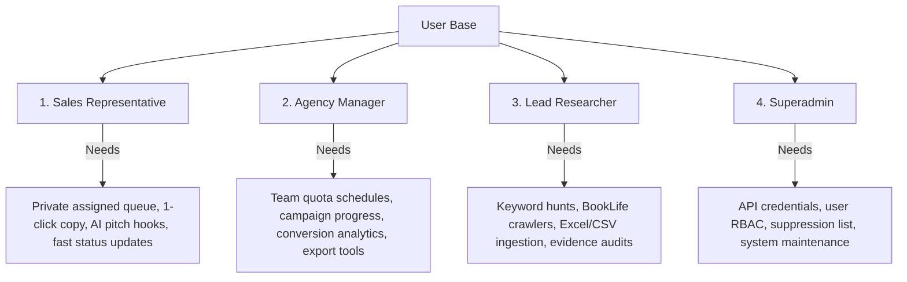

# 📄 Product Requirements Document (PRD)

* **Product Name:** Book Trailer Lead Finder
* **Version:** 3.0.0
* **Target Audience:** Video Production Studios, Book Trailer Animators, Book Marketing Agencies, B2B Sales Reps
* **System Framework:** Django 5.2.16 / Python 3.11–3.14 / Bootstrap 5.3.3

---

## 1. Executive Summary & Vision

The **Book Trailer Lead Finder** is an evidence-first B2B intelligence platform engineered to discover, qualify, verify, and deliver high-conversion sales leads for animated children's book trailers. 

Outreach teams targeting self-published and indie authors face noisy, unvetted data full of bookstore contact desks, retail catalog listings, mismatched author names, and low-confidence contact scraps. This platform solves the problem through a **deterministic, evidence-first pipeline** where every contact coordinate is audited, linked to its original source URL, scored from 0 to 100, and synthesized into personalized sales pitch briefs.

---

## 2. Target Personas

1. **Sales Representative:** Works daily out of `/leads/?assigned_to=me`. Needs instant access to author email addresses, one-click clipboard copying, AI-suggested first-line pitch hooks, and frictionless stage updating.
2. **Agency Manager:** Oversees outreach velocity, sets daily assignment quotas (`LeadAssignmentSchedule`), tracks campaign conversions, and exports qualified lead batches for CRM ingestion.
3. **Lead Researcher:** Configures keyword hunts (`/runs/new/`), imports external client workbooks, reviews unverified leads, and monitors crawler efficiency.
4. **Superadmin:** Manages API keys (Groq, Tavily, YouTube), provisions user accounts, enforces the `DoNotContact` suppression list, and oversees database health.

---

## 3. Current System Scale & Production Baseline

The platform currently operates with verified production data:
* **Total Books:** **1,843**
* **Total Leads:** **1,841**
* **Verified Ready Leads (Score $\ge 75$):** **1,042**
* **Needs Review Leads:** **799**
* **Contact Candidates:** **2,065**
* **Audited Evidence Records:** **3,836**
* **Automated Test Coverage:** **281 / 281 Tests Passing**

---

## 4. Functional Requirements

### 4.1 Lead Discovery & Ingestion
* **FR-1.1: Public Search Indexing:** Must discover Amazon book listing URLs via search engine indices (DDGS, Tavily, Brave) without scraping Amazon product pages directly or triggering anti-bot protections.
* **FR-1.2: BookLife Category Scraping:** Must discover newly listed indie children's books from Publishers Weekly BookLife category pages (`run_booklife_research`).
* **FR-1.3: Excel Dataset Ingestion:** Must ingest `.xlsx` and `.xlsm` workbooks (`import_excel_leads`). Must automatically detect and recover shifted columns (e.g. author name misplaced in Phone column, email in Proof URL column) and extract clean `YYYY-MM-DD` dates from descriptive text.
* **FR-1.4: ISBN & ASIN Intelligence Suite:**
  * Must validate ISBN-10, ISBN-13, and ASIN checksums using three mathematical implementations.
  * Must reconcile metadata across Open Library and Google Books API.
  * Must generate downloadable SVG EAN-13 barcodes (`/isbn-search/barcode/<identifier>.svg`).

### 4.2 Web Crawling & Enrichment
* **FR-2.1: Author Website Harvesting:** Must crawl author-owned website domains, contact pages, and media kits (`harvest_author_site_leads`).
* **FR-2.2: Bounded Bio-Link Crawling:** Must make a single, polite, robots-compliant pass through public social bio-link pages (Linktree, Carrd, Substack) pointing to author sites.
* **FR-2.3: Anti-Hallucination Video Classification:** Must query YouTube and Vimeo search APIs. If no trailer is found, it must record *"No public video found in searched sources"*. It must penalize leads with existing animated trailers and award bonus points to leads with no public trailer.

### 4.3 Multi-Layer Contact Verification Engine
* **FR-3.1: Obfuscation De-cloaking:** Must decode `[at]`, `(dot)`, URL-encoded `mailto:`, and Cloudflare email-protection markup into RFC 5322 compliant emails.
* **FR-3.2: Catalog & Bookstore Rejection Filter:** Must discard generic contact desks from libraries, university presses, and retailers (e.g. `openlibrary.org`, `goodreads.com`, `mit.edu`, `barnesandnoble.com`) while preserving literary agencies (`representation_email`) and PR desks (`publicist_email`).
* **FR-3.3: Author Identity Alignment:** Must compute token-sort and Levenshtein similarity between author names and domain names to ensure site ownership.
* **FR-3.4: Optional Network Deliverability:** Must perform asynchronous DNS MX lookups (`dnspython`) to verify active mailboxes.

### 4.4 Deterministic Scoring Engine
* **FR-4.1: Mathematical 0–100 Formula:** Scores must be computed out of 100 across 4 dimensions:
  * Book Fit (max 35 pts)
  * Contactability (max 35 pts)
  * Video Opportunity (max 20 pts)
  * Data Quality (max 10 pts)
* **FR-4.2: Hot Lead Classification:** Leads with Score $\ge 75$, verified email, and no trailer must receive the "Hot Lead" classification and green row badge.

### 4.5 AI Sales Briefs & Pitch Generation
* **FR-5.1: Structured Pitch Synthesis:** Must use Groq LLM (with deterministic offline templates) to generate:
  * Summary & Book Data
  * Why the lead matters
  * Custom first-line pitch email
  * Compliance guidelines for sales reps

### 4.6 Sales CRM & Role-Based Access Control (RBAC)
* **FR-6.1: Role Tiers:** Must enforce `superadmin`, `manager`, and `sales` roles. Sales reps must only access their assigned queue (`/leads/?assigned_to=me`).
* **FR-6.2: Automated Quota Distribution:** Must allow managers to define daily assignment schedules (`LeadAssignmentSchedule`) allocating $N$ verified leads per weekday to designated reps.
* **FR-6.3: Pipeline Stages:** Must support: `Pending` ➔ `In Progress` ➔ `Contacted` ➔ `Meeting Booked` ➔ `Closed Won` / `Lost`.

### 4.7 Background Scheduler Daemon
* **FR-7.1: Continuous Execution:** `run_scheduler_loop --daemon` must execute recurring hunts across daily, interval, weekly, or specific-days schedules.
* **FR-7.2: Stale Lease Recovery:** Must safely reclaim tasks left in `running` state by crashed workers after `APP_SCHEDULED_TASK_LEASE_SECONDS` (default 6 hours).

### 4.8 UI/UX Requirements (Optimized for 1440×900)
* **FR-8.1: Strict 7-Column Responsive Layout:** The desktop leads table must strictly follow:
  * Checkbox: `38px`
  * Book Details: `32%` (min 260px) – 2-line title clamp (`-webkit-line-clamp: 2`), `white-space: normal`, full title tooltip.
  * Author & Contact: `27%` – author profile link, copy button, verified badge.
  * Channels: `11%` – Amazon, Website, Mail, Social icon badges.
  * Published: `10%` – clean `YYYY-MM-DD` date format.
  * Task: `11%` – task assignment badge and sales owner name.
  * Actions: `9%` – 3-dots dropdown menu.
* **FR-8.2: Zero Horizontal Scroll:** No horizontal scrollbar on displays $\ge 1280\text{px}$ width.
* **FR-8.3: Dropdown Stacking Context Integrity:** Table rows (`<tr>`) must never retain `transform` properties after entrance animations. Active dropdown rows must elevate to `z-index: 1050 !important;` and menus to `z-index: 1070 !important;`.
* **FR-8.4: One-Click Copy:** Every visible contact must feature an instant clipboard copy button with visual feedback.

### 4.9 Multi-Format Exports
* **FR-9.1: CSV Streaming:** Stream filtered leads with source URLs and confidence metrics (`/export/leads.csv`).
* **FR-9.2: Formatted Excel:** Generate multi-sheet styled `.xlsx` workbooks with auto-fit columns and clickable links (`/export/leads.xlsx`).

---

## 5. Non-Functional Requirements

* **Performance:** Lead list page render time must be $< 450\text{ms}$ for 25 leads.
* **Database Reliability:** Must support ACID transactions for atomic task claims and lead assignments.
* **Security:** Enforce rate-limited logins, CSRF tokens on all state-changing endpoints, HTTP-only session cookies, and JWT bearer authentication for APIs.
* **Maintainability:** 100% test pass rate across the 281-test Pytest suite.

---

## 6. Compliance & Safety Boundaries

The system explicitly prohibits:
1. Scraping Amazon product pages directly.
2. Bypassing CAPTCHA, Cloudflare, login walls, or rate limits.
3. Scraping private or logged-in social media accounts.
4. Using leaked databases or dark-web contact lists.
5. Automatically sending outreach emails (human-in-the-loop required).
6. Asserting that an author definitely has no video.

---

## 7. Acceptance Criteria

1. All **281 automated tests** pass (`python -m pytest leadfinder/tests`).
2. Both Excel workbooks (`leads data.xlsx` and `leads dev-ali.xlsx`) ingest cleanly without column-shift errors.
3. Leads table renders perfectly at 1440×900 resolution with zero horizontal scroll.
4. Action dropdown menu renders completely elevated above subsequent rows without bleeding elements.
5. CSV and XLSX exports match filtered views and contain all source audit URLs.
