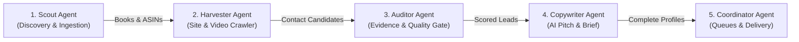

# 🤖 .agent Operating Manual & Agent DNA Index

Welcome to the **`.agent`** core system directory for the **Book Trailer Lead Finder** platform. This directory serves as the authoritative blueprint and execution manual for autonomous AI agents, automated worker daemons, and software engineers working on this codebase.

---

## 🗂️ Agent Documentation Index

| File | Purpose | Key Content |
| :--- | :--- | :--- |
| [**PRD.md**](PRD.md) | **Product Requirements Document** | Complete product specifications, user personas, functional/non-functional requirements, compliance boundaries, and acceptance criteria. |
| [**FEATURES.md**](FEATURES.md) | **Feature Specifications** | Deep breakdown of all platform features: Discovery, Ingestion, ISBN Suite, Verification, AI Briefs, RBAC Queues, and Exports. |
| [**SKILLS.md**](SKILLS.md) | **Programmatic Skills Catalog** | Comprehensive inventory of all 22 management commands, scraper services, ISBN analyzers, Groq prompt engines, and export utilities. |
| [**WORKFLOWS.md**](WORKFLOWS.md) | **Multi-Agent Orchestration Workflows** | SOP workflows: Discovery, Ingestion & Shift Recovery, Bio-Link Crawling, Verification Gates, Scheduled Daemon, and Sales Pipeline. |
| [**LOGIC_A_TO_Z.md**](LOGIC_A_TO_Z.md) | **Master A-to-Z Execution Logic** | Exhaustive step-by-step logic map from raw input to final export, scoring formulas, regex de-cloakers, domain blacklists, and CSS rules. |

---

## 🏛️ Autonomous Agent Roles

The system coordinates five specialized agent roles across the lead generation lifecycle:

1. **The Scout:** Ingests external datasets (Excel/CSV), queries public search indices (DDGS, Tavily, Brave), and reconciles ISBN/ASIN metadata.
2. **The Harvester:** Performs polite, bounded crawling of author websites, social bio-links (Linktree, Carrd, Substack), and checks video channels for existing trailers.
3. **The Auditor:** Filters out catalog/bookstore contacts, aligns author identity against domains, audits MX records, and computes deterministic 0–100 scores.
4. **The Copywriter:** Analyzes book themes via Groq LLM (with deterministic local fallback) to formulate personalized sales pitch hooks and custom first-line emails.
5. **The Coordinator:** Distributes qualified leads into private sales rep queues, manages the global `DoNotContact` suppression list, and exports formatted CSV/XLSX workbooks.

---

## ⚡ Core Directives for Autonomous Agents

When operating within this codebase, all autonomous agents must strictly enforce:

1. **Evidence-First Standard:** Every contact signal must link to an `Evidence` model instance containing a verifiable `source_url` and HTTP timestamp.
2. **Safe Language Anti-Hallucination:** When no video trailer is found in searched sources, always record *"No public video found in searched sources"*. Never assert that an author definitely has no video.
3. **CSS Stacking Context Protection:**
   - Never use `transform` or `animation-fill-mode: both / forwards` on table rows (`<tr>`). Doing so creates rogue Stacking Contexts that cause table rows to paint over open dropdown menus.
   - Maintain the fluid 7-column desktop layout (`38px`, `32%`, `27%`, `11%`, `10%`, `11%`, `9%`).
   - Elevate active dropdown rows and cells with `z-index: 1050 !important; position: relative !important;`.
4. **Zero-Test-Failure Rule:** Always run `python -m pytest leadfinder/tests` before delivering changes. All 281 tests must pass.
