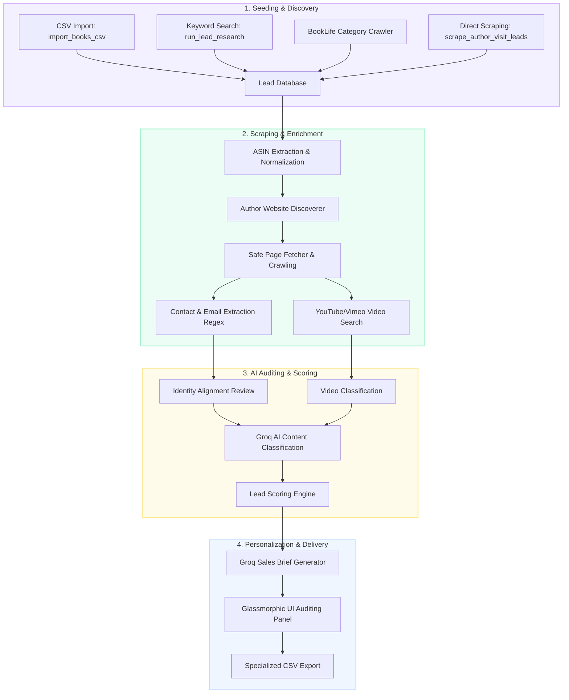

# Lead Finder Workflows & Pipelines

This document details the standard operating procedures, architectural data flow, and processing stages for identifying and qualifying children's book author leads.

---

## 🗺️ Architectural Data Flow

Below is the standard, end-to-end data flow mapping how leads move from initial seeding/discovery to scoring, pitch generation, and export:



---

## 🔄 Core Pipeline Workflows

### Workflow 1: Standard Discovery & Enrichment Loop
The default pipeline discovers book candidates from search results or BookLife and progressively enriches them through web crawls, video searches, and AI audits.

1. **Discovery:** Discovers book metadata (Title, Author, ASIN, Amazon URL) via search providers or BookLife.
2. **Contact Discovery:** Discovers candidate author-owned websites by querying the author name.
3. **Contact Harvesting:** Iterates over the first `N` pages (typically `/contact`, `/about`, `/school-visits`), checking robots.txt, fetching the page safely, and executing regular expressions to find public professional emails and phone numbers.
4. **Video Opportunity Discovery:** Searches YouTube or Vimeo for the book title + `"trailer"` or `"animated video"`. If not found, sets the status to `no_public_video_found`.
5. **Auditing & Classification:** Groq (or a deterministic fallback) classifies the book category (children's picture book fit) and audits candidate links.
6. **Scoring:** The Lead Scoring Engine calculates a score based on children's fit (up to 30), contactability (up to 30), video opportunity (up to 20), and data quality (up to 20).
7. **Brief Writing:** Writes a custom sales brief containing personalization angles, recommended pitches, and compliance recommendations.

---

## 📋 Operational Recipes & SOPs

Here are standard shell commands to run for different scraping goals.

### 🚀 Recipe A: The Advanced Tavily + Groq Run (High Quality)
Use this recipe when Tavily and Groq API keys are configured for maximum data fidelity and rich sales copywriting.

```powershell
# Run lead research using Tavily for high-accuracy discovery
python manage.py run_lead_research --keyword "bedtime picture book" --max-books 40 --provider tavily

# View the dashboard / verification report
# Open: http://127.0.0.1:8000/dashboard/
```

### 🔁 Recipe B: The 700 Leads Bulk Harvest (Set & Forget)
Use this recipe to harvest a large number of leads in the background. It will automatically cycle through keywords and save qualified leads to a CSV.

```powershell
python manage.py run_bulk_lead_research --target-leads 700 --batch-size 25 --provider tavily --output data/leads_export_700.csv
```

### 🏫 Recipe C: Direct School Visits & Booking Scraper
Use this recipe when focusing specifically on authors who actively promote school presentations or virtual assembly bookings, matching them directly to Amazon titles.

```powershell
python manage.py scrape_author_visit_leads --target-leads 200 --output data/school_visit_leads.csv --sleep 0.2
```

---

## 🛡️ Critical Guidelines & Compliance Rules

To maintain compliance and avoid rate limits or IP bans, all active agents must follow these rules:

1. **NO Amazon Scraping:** Do not attempt to scrape Amazon product details directly. Normalise and parse ASINs deterministically using `amazon_url_parser.py` or index cache tables.
2. **Polite Crawling delays:** Maintain a polite crawl delay (at least `0.15s` to `0.5s` between requests) and always inspect the response codes or `robots.txt` before fetching.
3. **No Private Scraping:** Do not scrape private personal directories, social walls requiring logins (Facebook, LinkedIn, Instagram), or people search databases (Spokeo, BeenVerified). Only extract visible, public email/phone details from official author websites.
4. **Literary Agents & Booking Channels:** Publicist and agency emails (e.g. `publicist@publisher.com`, `agent@literaryagency.com`) are valid contact paths. Do not reject them as catalog domains.
5. **No Claims of marketing deficiency:** Personalization briefs should never claim an author's marketing is poor or that they have "no video" (use: *"no public video found in searched sources"*).
