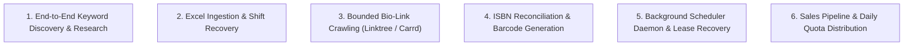
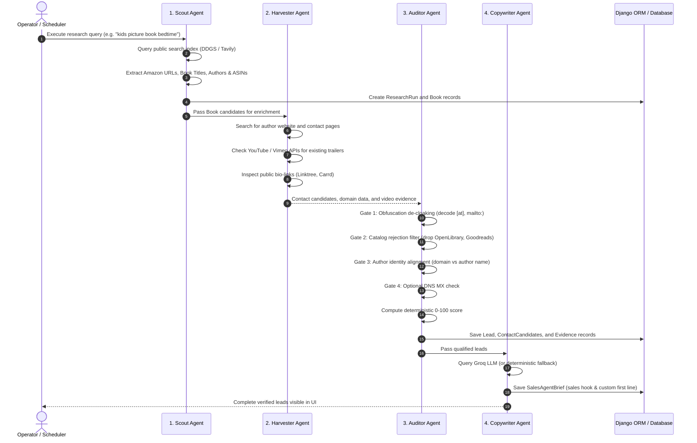
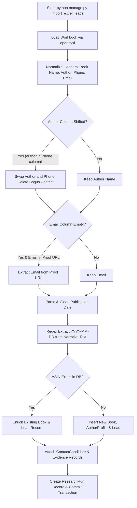
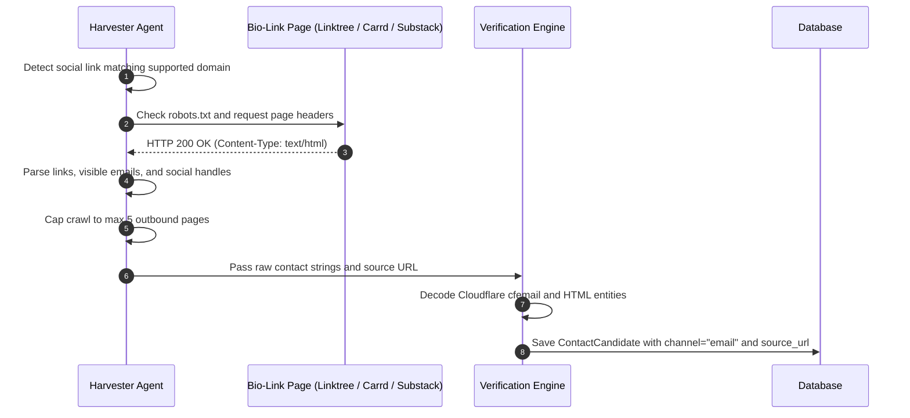
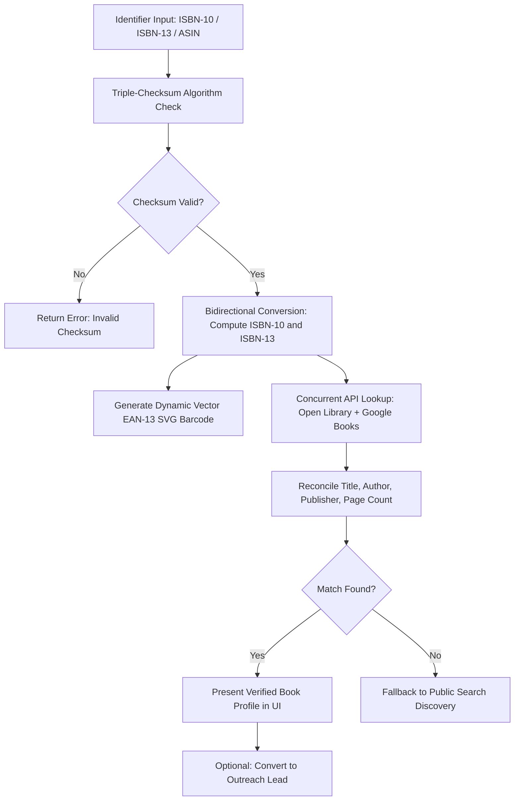
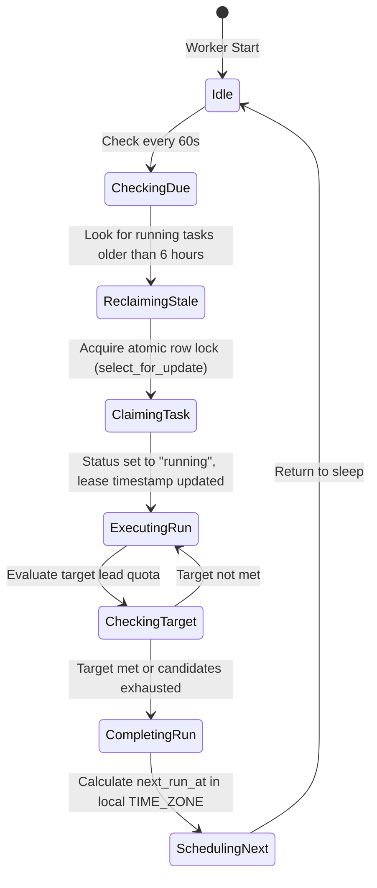
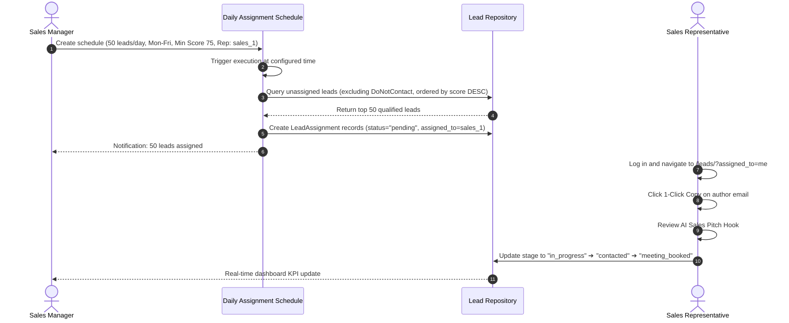

# 🔄 Multi-Agent Orchestration Workflows (WORKFLOWS.md)

This document details the standard operating procedures (SOP), sequence diagrams, and lifecycle state machines governing autonomous agent workflows within the **Book Trailer Lead Finder** application.

---

## 📑 Core Workflows Overview

---

## 1. End-to-End Keyword Discovery & Assembly Workflow

This workflow represents the standard automated research pipeline executed when an operator or scheduler enters a search query.

---

## 2. Excel Dataset Ingestion & Shift Recovery Workflow

Ingests external client spreadsheets (`leads data.xlsx`, `leads dev-ali.xlsx`) with automated data cleaning and anomaly correction.

### Anomaly Recovery Rules:
1. **Author Misplacement Rule:** If `Author / Owner Name` contains descriptive keywords (e.g. `"children"`, `"page"`, `"verified"`) and `Phone` contains text without digits, swap `author_name = raw_phone` and discard `phone`.
2. **Shifted Email Rule:** If `Email` is empty and `Email Proof URL` contains an `@` symbol without `http`, assign `email = email_proof_url`.
3. **Date Regularization Rule:** Apply regex pattern `r'\b(20\d{2}[-/]\d{1,2}[-/]\d{1,2})\b'` to extract standard dates from long review paragraphs.

---

## 3. Bounded Bio-Link Crawling Workflow

Targets secondary link hubs to discover author contact coordinates safely.

---

## 4. ISBN Reconciliation & Barcode Generation Workflow

Validates international standard book numbers and compiles multi-catalog metadata.

---

## 5. Background Scheduler Daemon & Lease Recovery Workflow

Executes recurring lead research tasks without supervisor intervention.

---

## 6. Sales Pipeline & Daily Quota Distribution Workflow

Automates daily lead delivery to sales reps while preserving history and suppression rules.

