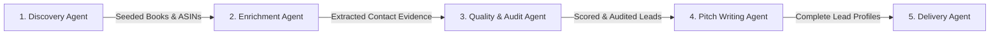
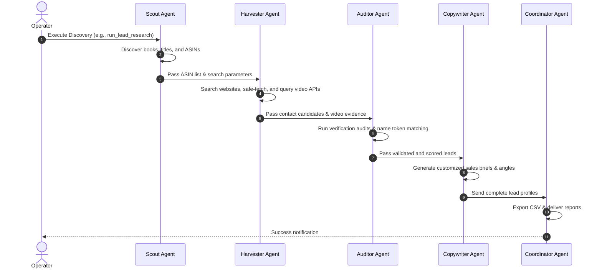

# Multi-Agent Coordination Handbook (AGENTS.md)

This handbook defines the roles, responsibilities, capabilities, and coordination workflows of the specialized AI Agents operating within the **Book Trailer Lead Finder** project. 

Each agent is designed to execute specific **Skills** and participate in designated **Workflows** to assemble high-conversion children's book author leads.

---

## 🤖 Agent Roles & Architecture Overview

The pipeline leverages five specialized agent roles to handle lead discovery, enrichment, quality control, copywriting, and distribution:

---

## 🔎 Agent Detailed Profiles

### 1. The Scout (Lead Discovery Agent)
* **Objective:** Discover potential book candidates matching the children's picture book fit.
* **Responsibilities:**
  * Define keyword lists and suggest terms using the keyword badge suggester.
  * Fetch listing data from PW BookLife category index pages.
  * Import seed book lists from CSVs supplied by the client.
* **Active Skills Used:**
  * `run_lead_research` (keyword lookup)
  * `run_bulk_lead_research` (looping keyword lookup)
  * `run_booklife_research` (BookLife category indexing)
  * `import_books_csv` (CSV seeding)
* **Workflow Input/Output:**
  * **Input:** Raw search queries, CSV seeds.
  * **Output:** Database records containing book title, author, ASIN, and Amazon URL.

---

### 2. The Harvester (Lead Enrichment & Scraping Agent)
* **Objective:** Discover the author's official online profiles, contact coordinates, and video presence.
* **Responsibilities:**
  * Look up official author websites, publishers, and speaking pages using web search indexing.
  * Crawl author-owned pages politely (complying with robots.txt, timeouts, and safe delays).
  * Pull visible public professional emails and phone numbers.
  * Scan public search results and YouTube/Vimeo APIs for existing animated trailers or promotional videos.
* **Active Skills Used:**
  * `scrape_author_visit_leads` (direct visit harvesting)
  * `pull_tavily_validated_leads` (Tavily contact lookup)
  * `enrich_existing_leads` (Amazon ASIN backfill scraper)
* **Workflow Input/Output:**
  * **Input:** Database book records.
  * **Output:** Candidate emails, phones, social URLs, website domains, and video statuses.

---

### 3. The Auditor (AI Verification & Audit Agent)
* **Objective:** Audit the integrity of scraped contacts to eliminate mismatch risks and non-children's books.
* **Responsibilities:**
  * Perform name similarity audits between domain, page title, and author name to ensure site ownership.
  * Screen contact emails to filter out generic bookstores, retailers, catalog lists, and support desks (e.g. Open Library, Goodreads, MIT Press Bookstore).
  * Safely accept agent channels (`representation_email`) and PR desks (`publicist_email`) as verified contact channels.
  * Audit video classification to distinguish read-alouds and amateur recordings from professionally animated trailers.
* **Active Skills Used:**
  * `sanitize_contact_sources` (clean up catalog links)
  * Verification reports & identity checks (`is_valid_author_name`, `valid_email`)
* **Workflow Input/Output:**
  * **Input:** Raw contact candidates and source snippets.
  * **Output:** Identity alignment confidence score, audit trail events, and final validation status.

---

### 4. The Copywriter (Pitch Writing Agent)
* **Objective:** Construct a highly contextual, personalized, and compliant sales brief for outreach agents.
* **Responsibilities:**
  * Analyze book summaries and categories to isolate unique selling angles (e.g. animal themes, bedtime fit).
  * Identify potential visual promo fits (e.g. short social ads, animated trailer hooks).
  * Generate suggested custom first-line emails that build immediate rapport.
  * Produce clear instructions outlining compliance items (e.g. *"Do not say they have poor marketing"*).
* **Active Skills Used:**
  * Groq structured completion (with deterministic fallback templates for offline execution).
* **Workflow Input/Output:**
  * **Input:** Audited lead details, book summary, video status.
  * **Output:** Fully completed sales brief matching lead details.

---

### 5. The Coordinator (Delivery Agent)
* **Objective:** Package, sanitize, and deliver finalized lead lists to production teams or outreach databases.
* **Responsibilities:**
  * Enforce final data qualification thresholds (e.g. require email, require ASIN, require low-video presence).
  * Clean up and output compiled database entries to highly structured CSV formats.
  * Manage database states, mark bad records as `do_not_contact`, and recalculate scores post-sanitization.
* **Active Skills Used:**
  * `export_leads_csv`
  * `export_validated_author_leads`
  * `export_contactable_leads_csv`
  * `export_best_animation_leads`
* **Workflow Input/Output:**
  * **Input:** Scored and completed database entries.
  * **Output:** Production-ready export sheets (`leads.csv`).

---

## 🤝 Multi-Agent Task Orchestration (SOP)

When a new scraping project begins, the coordination pipeline triggers agent duties in the following order:

