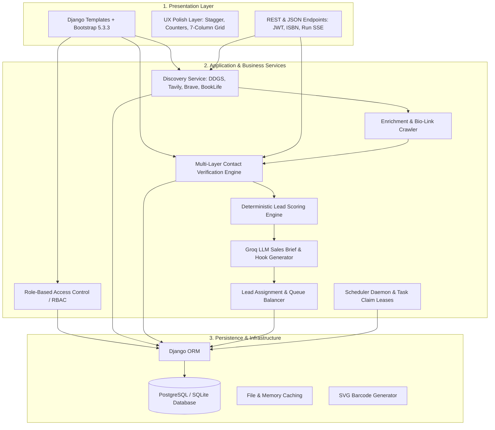
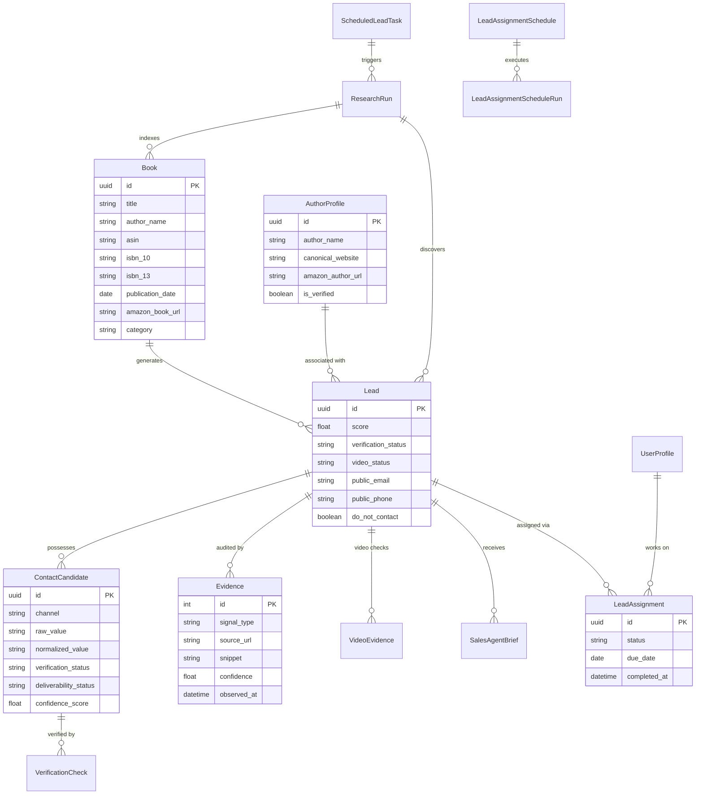
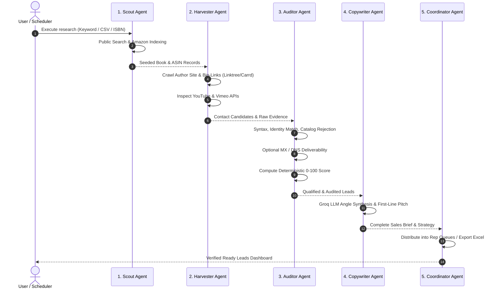

# 🏛️ System Architecture & Engineering Design

This document details the architectural principles, domain models, pipeline layers, and engineering decisions powering the **Book Trailer Lead Finder** application.

---

## 1. Architectural Principles & Philosophy

The system is designed around four non-negotiable engineering principles:

1. **Evidence-First Truth:** No contact coordinate, book metadata, or video presence is ever recorded without a verifiable source URL, HTTP timestamp, and confidence rating.
2. **Deterministic & Explainable Scoring:** Confidence and qualification scores are mathematically computed out of 100 via transparent, auditable rules—never opaque black-box heuristics.
3. **Anti-Hallucination Safe Language:** The system never makes definitive negative claims. When no video trailer is detected across searched public channels, the record states: *"No public video found in searched sources."*
4. **Compliance & Politeness by Default:** The crawler respects `robots.txt`, strictly bounds crawling depth, complies with standard rate limits, ignores private profiles, and never attempts CAPTCHA or Cloudflare bypasses.

---

## 2. High-Level Layered Architecture

---

## 3. Data Domain Models & Entity Relationships

The relational schema is anchored around the relationship between `Book`, `AuthorProfile`, and `Lead`, backed by detailed audit entities.

---

## 4. Multi-Agent Pipeline Specialization

The ingestion and research lifecycle is divided into five specialized agent roles:

---

## 5. Multi-Layer Contact Verification Engine

The verification engine in `leadfinder/services/contact_verification_engine.py` validates every candidate email and phone through independent sequential gates:

1. **Gate 1: Syntax & Obfuscation De-cloaking**
   - Normalizes unicode, decodes URL escapes, cleans `mailto:`, and parses Cloudflare email-protection markup.
   - Converts patterns like `name [at] domain (dot) com` into standard RFC 5322 formats.
2. **Gate 2: Bookstore & Catalog Rejection Filter**
   - Scans against a compiled list of libraries, university presses, publishers, and retailers (e.g. `openlibrary.org`, `goodreads.com`, `mit.edu`, `barnesandnoble.com`).
   - If an email belongs to a catalog desk, it is rejected unless identified as a literary agency (`representation_email`) or PR publicist (`publicist_email`).
3. **Gate 3: Identity & Domain Alignment**
   - Uses `tldextract` to inspect the domain of author websites against the author's legal and pen names.
   - Calculates Levenshtein and token-sort similarity ratios to ensure the website is owned by the author.
4. **Gate 4: Network Deliverability (Optional)**
   - Performs asynchronous DNS MX lookups (`dnspython`) to ensure the domain accepts mail.
   - Optional SMTP handshake checks without transmitting message content.

---

## 6. Deterministic Lead Scoring Formula (0–100)

Leads are scored dynamically based on four objective dimensions:

$$\text{Final Score} = \text{Book Fit} + \text{Contactability} + \text{Video Opportunity} + \text{Data Quality}$$

| Dimension | Max Points | Evaluation Criteria |
| :--- | :---: | :--- |
| **Book Fit** | **35 pts** | Children's or picture book signals (+15), valid Amazon URL/ASIN (+10), recent publication within 24 months (+10). |
| **Contactability** | **35 pts** | Verified direct author email (+25), verified agent/PR email (+15), phone number (+5), contact form (+5). |
| **Video Opportunity** | **20 pts** | `no_public_video_found` in searched sources (+20), amateur read-aloud only (+10), existing animated trailer (-25). |
| **Data Quality** | **10 pts** | High identity alignment ratio (+5), multiple corroborating evidence sources (+5). |

* **Hot Lead Classification:** Score $\ge 75$, verified deliverable email, valid Amazon listing, and no existing trailer found.

---

## 7. UI/UX Architecture & Responsive Stacking Rules

### Exact 7-Column Table Proportions (Desktop 1440×900)
To prevent horizontal scrollbars and squished text cells, the table header and body use strictly defined percentage allocations:
* **Checkbox:** `38px` fixed width
* **Book Details:** `32%` (min 260px) – 2-line title clamp (`-webkit-line-clamp: 2`), `white-space: normal`, full title tooltip.
* **Author & Contact:** `27%` – author profile link, copy button, verified badge.
* **Channels:** `11%` – Amazon, Website, Mail, Social icon badges.
* **Published:** `10%` – clean `YYYY-MM-DD` date format.
* **Task:** `11%` – task assignment badge and sales owner name.
* **Actions:** `9%` – 3-dots dropdown menu.

### Stacking Context & Z-Index Hierarchy
To prevent table rows from rendering over opened dropdown menus:
1. Table rows do not retain persistent `transform` properties after entrance animations.
2. Active rows and cells are elevated with `z-index: 1050 !important; position: relative !important;`.
3. Dropdown menus are isolated at `z-index: 1070 !important;` with opacity-only keyframe transitions.

---

## 8. Role-Based Access Control (RBAC)

The system provides three distinct permission tiers:

| Tier | Role Slug | Capabilities & Scope |
| :--- | :--- | :--- |
| **Superadmin** | `superadmin` | Unrestricted access across all leads, API tokens, user management, and system settings. |
| **Manager** | `manager` | Creates research runs, scheduled tasks, assigns leads to reps, and views team analytics. |
| **Sales Rep** | `sales` | Restricted to their private assigned leads queue (`/leads/?assigned_to=me`), status transitions, and pitch copy. |

---

  
For implementation details on specific components, refer to <a href="CLI_REFERENCE.md">CLI_REFERENCE.md</a> and <a href="API_DOCUMENTATION.md">API_DOCUMENTATION.md</a>.

