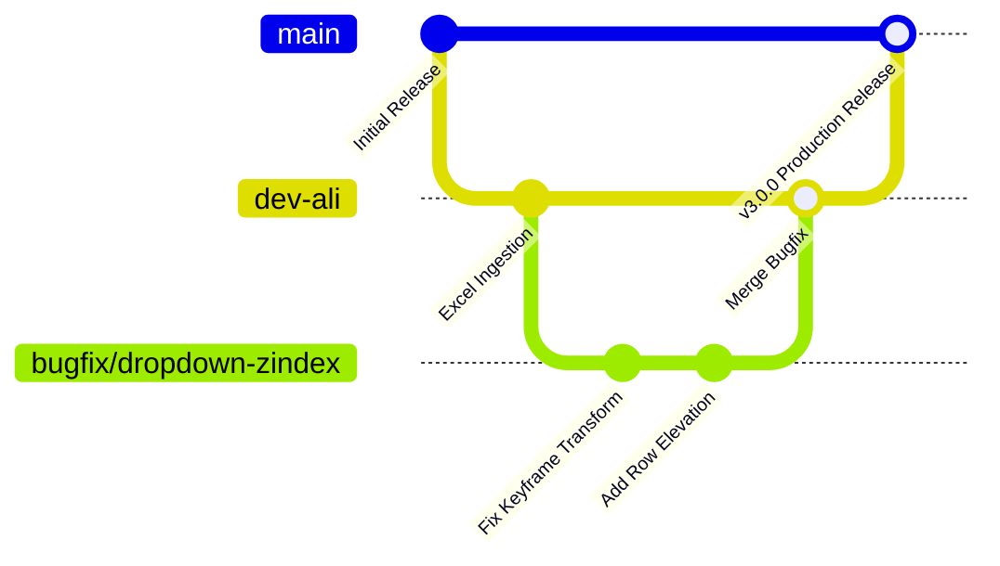

# 🤝 Contributing & Engineering Standards

Thank you for contributing to the **Book Trailer Lead Finder** project. This document outlines our branch management strategy, code standards, testing policies, and pull request checklist.

---

## 🌿 Branching Strategy & Workflow

We follow a feature-branch workflow built on top of our active development branch:

* **`main`**: Production-ready, deployed stable releases.
* **`dev-ali`**: Active integration branch where tested features and UI improvements converge.
* **Feature Branches**: Branch from `dev-ali` using semantic prefixes:
  * `feature/<feature-name>` (e.g., `feature/author-social-crawler`)
  * `bugfix/<issue-name>` (e.g., `bugfix/dropdown-stacking-context`)
  * `docs/<topic>` (e.g., `docs/api-update`)



---

## 📐 Code Style & Architecture Guidelines

### Python (Backend & Services)
* **PEP 8 Compliance:** Adhere to PEP 8 standards with 4-space indentation.
* **Typing:** Use Python type annotations (`typing.Optional`, `typing.List`, etc.) for public function signatures.
* **Preserve Documentation:** Do not delete existing docstrings or explanatory comments unless explicitly updating obsolete logic.
* **Deterministic Rules:** Avoid non-deterministic algorithms in the verification engine. Every scoring boost or penalty must have an identifiable rule and evidence record.

### CSS & Design System
* **Strict 7-Column Table Layout:** The desktop leads table must strictly follow:
  * Checkbox: `38px`
  * Book Details: `32%`
  * Author & Contact: `27%`
  * Channels: `11%`
  * Published: `10%`
  * Task: `11%`
  * Actions: `9%`
* **Stacking Context Protection:**
  * **Never** use `animation-fill-mode: both` or `forwards` with non-`none` `transform` on table rows (`<tr>`). Any non-`none` transform creates a permanent CSS Stacking Context that causes subsequent rows to paint over open dropdowns.
  * Dropdown animations must only transition `opacity` so that Popper's calculated `translate3d(x, y, 0)` coordinates are never obliterated.
  * Active dropdown rows must be elevated with `z-index: 1050 !important; position: relative !important;`.

### JavaScript
* **Vanilla First:** Use modern vanilla JavaScript (`ES6+`) without adding external frontend frameworks or heavy dependencies.
* **Passive Listeners:** Use `{ passive: true }` on window scroll listeners.
* **Bootstrap 5 Integration:** Hook into Bootstrap lifecycle events (`show.bs.dropdown`, `hidden.bs.dropdown`) for DOM state management.

---

## 🧪 Testing & Verification Requirements

No pull request will be accepted unless all tests pass.

### 1. Automated Test Suite
Run the full test suite before committing:
```powershell
python -m pytest leadfinder/tests
```
All **281 tests** must pass without errors or regressions.

### 2. Django System Checks
Run migrations dry-run and configuration checks:
```powershell
python manage.py check
python manage.py makemigrations --check --dry-run
```

### 3. Visual Verification (1440×900 Viewport)
When modifying UI components, test with Playwright at 1440×900:
```powershell
python -c "from playwright.sync_api import sync_playwright; p = sync_playwright().start(); b = p.chromium.launch(); page = b.new_page(viewport={'width': 1440, 'height': 900}); page.goto('http://127.0.0.1:3005/leads/'); page.screenshot(path='test_ui.png'); b.close(); p.stop()"
```
Confirm:
* Zero horizontal scrollbars on desktop displays.
* No text squishing or single-word line wrapping in book titles.
* Dropdown menus render cleanly above subsequent rows.

---

## ✅ Pull Request Checklist

Before submitting a pull request to `dev-ali`:

- [ ] All 281 automated tests pass (`python -m pytest leadfinder/tests`).
- [ ] No extraneous dependencies added to `requirements.txt` (see [DEPENDENCY_REVIEW.md](DEPENDENCY_REVIEW.md)).
- [ ] New management commands or models are documented in [CLI_REFERENCE.md](CLI_REFERENCE.md) and [ARCHITECTURE.md](ARCHITECTURE.md).
- [ ] Static asset versions are bumped in `base.html` if modifying `app.css`, `ux-polish.css`, or `ux-polish.js`.
- [ ] Git commit messages are descriptive and follow standard conventional formatting:
  * `feat: add social bio-link crawler for Carrd pages`
  * `fix: prevent table row transform from creating stacking context`
  * `docs: update CLI reference for import_excel_leads`
