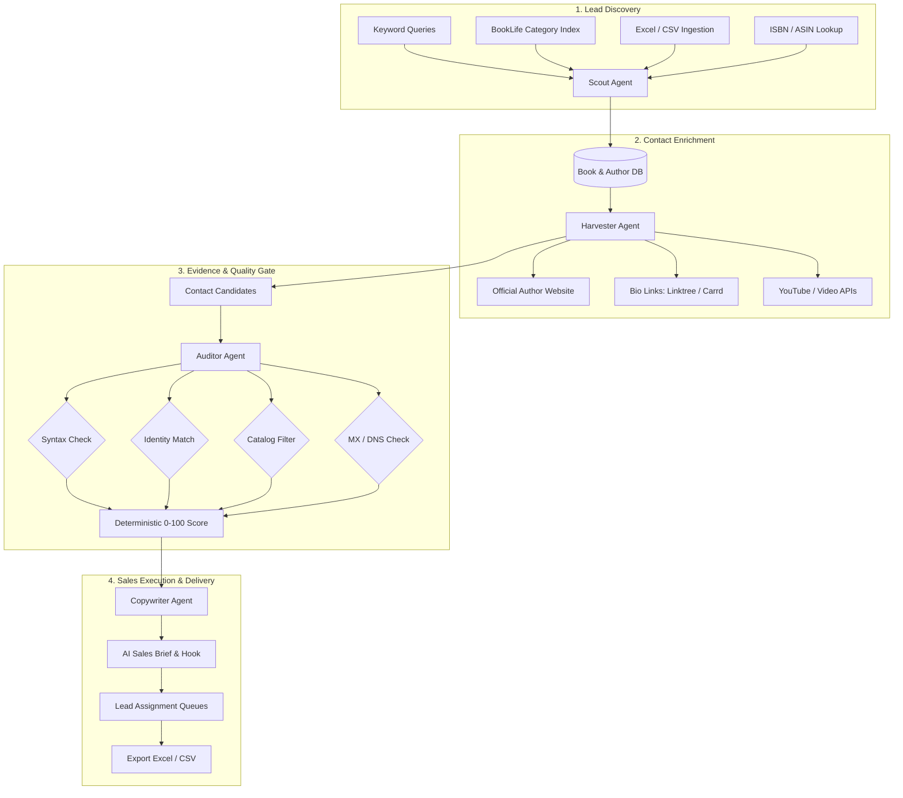

<div align="center">
  <h1>🎬 Book Trailer Lead Finder</h1>
  <p><strong>Intelligent Lead Research, Evidence-First Verification & Discovery for Children's Book Authors</strong></p>
  <p>
    
    
    
    
    
  </p>
</div>

---

## 📑 Project Documentation Index

This repository contains comprehensive, production-ready documentation files:

* 📘 [**README.md**](README.md) – Executive overview, quick start, and feature summary.
* 🏛️ [**ARCHITECTURE.md**](ARCHITECTURE.md) – System design, data models, multi-agent pipeline, and scoring engine.
* 🔌 [**API_DOCUMENTATION.md**](API_DOCUMENTATION.md) – REST API, JWT auth, ISBN lookup, and internal endpoints.
* ⚙️ [**SETUP_AND_INSTALLATION.md**](SETUP_AND_INSTALLATION.md) – Step-by-step developer setup, database migration, and Excel seeding.
* 📖 [**USER_GUIDE.md**](USER_GUIDE.md) – Sales team manual, lead filtering, AI pitch generation, and exports.
* 💻 [**CLI_REFERENCE.md**](CLI_REFERENCE.md) – Complete reference for all 22 Django management commands.
* 🚀 [**DEPLOYMENT.md**](DEPLOYMENT.md) – Production deployment with Gunicorn, Nginx, PostgreSQL, and systemd.
* 🤝 [**CONTRIBUTING.md**](CONTRIBUTING.md) – Branching guidelines, test suite, and pull request workflow.
* 📜 [**CHANGELOG.md**](CHANGELOG.md) – Release notes, bug fixes, UI/UX polish, and dataset updates.
* 🤖 [**AGENTS.md**](AGENTS.md) – Autonomous multi-agent coordination handbook and skills.
* 🔄 [**walkthrough.md**](walkthrough.md) – End-to-end operational guide and scheduler verification.
* 🔐 [**ROLE_ACCESS_AND_ASSIGNMENT.md**](docs/ROLE_ACCESS_AND_ASSIGNMENT.md) – Role-based access control (RBAC) and sales assignment queues.

---

## 📖 Overview

**Book Trailer Lead Finder** is an evidence-first B2B lead generation and research platform engineered specifically for book trailer video producers, animators, and book marketing agencies.

Unlike ordinary scrapers that guess contact information or rely on unverified social dumps, this platform operates on an **Evidence-First** standard:
* **Source-Audited Signals:** Every contact coordinate (email, phone, agent, publicist) is stored with its exact source URL, HTTP timestamp, and confidence rating.
* **Deterministic Scoring (0–100):** Leads are ranked based on book fit, author identity certainty, verified contactability, and trailer opportunities.
* **Anti-Hallucination Video Classification:** When no promo video exists in searched public sources, the system explicitly labels it *"No public video found in searched sources"*, avoiding false claims.
* **AI-Assisted Pitch Generator:** Integrates with Groq LLM (with deterministic local fallbacks) to produce contextual, personalized sales hooks and outreach briefs for sales reps.

---

## ⚡ Core Highlights & Capabilities

### 1. Robust Lead Discovery & Ingestion
* **Search-Index Discovery:** Discovers Amazon book listings via public search engines (DDGS, Tavily, Brave) without violating Amazon's terms of service or triggering anti-bot protections.
* **Excel & CSV Ingestion:** Ingests external datasets seamlessly (such as `leads data.xlsx` and `leads dev-ali.xlsx`), automatically handling shifted columns, cleaning raw publication dates, and normalizing contacts.
* **ISBN & ASIN Intelligence:** Triple-checksum validation (ISBN-10, ISBN-13, ASIN), bidirectional conversion, Open Library / Google Books metadata reconciliation, and SVG barcode generation.

### 2. Deep Multi-Layer Contact Verification
* **Author Identity Alignment:** Verifies that candidate websites and social profiles genuinely match the author rather than similarly named individuals.
* **Obfuscation De-cloaking:** Resolves `[at]`, `(dot)`, URL-encoded `mailto:`, and Cloudflare email protection tags into clean, deliverable addresses.
* **Catalog Rejection Filtering:** Discards non-author bookstore or library emails (e.g. Open Library, Goodreads, MIT Press) while retaining literary agents (`representation_email`) and PR bookings (`publicist_email`).
* **DNS & SMTP Verification:** Optional network deliverability checks to confirm MX records and mailbox availability.

### 3. Modern Glassmorphic UI/UX (Optimized for 1440×900 & Laptops)
* **Fluid 7-Column Layout:** Checkbox (38px), Book Details (32%), Author & Contact (27%), Channels (11%), Published (10%), Task (11%), Actions (9%) with zero horizontal scroll on desktop.
* **Bulletproof Stacking & Elevation:** Dropdown menus float crisply over subsequent rows without z-index bleed or element clipping.
* **Interactive Controls:** Instant search, quick filter pills, real-time KPI counter animations, and one-click clipboard copying.

### 4. Sales Pipeline & Role-Based Access Control (RBAC)
* **Role Tiers:** `Superadmin` (full configuration), `Manager` (team schedules & campaigns), and `Sales Rep` (assigned private lead queue).
* **Automated Lead Distribution:** Recurring schedules distribute verified leads into rep queues based on daily quotas.
* **Pipeline Stages:** `Pending` ➔ `In Progress` ➔ `Contacted` ➔ `Meeting Booked` ➔ `Lost` ➔ `Closed Won`.

---

## 🏗️ System Architecture & Workflow



---

## 🚀 Quick Start Guide

### 1. Clone & Set Up Virtual Environment
```powershell
# Navigate to project directory
cd d:\lead-scraping\django\booktrailer_leads

# Create and activate Python virtual environment
python -m venv .venv
.\.venv\Scripts\Activate.ps1

# Install production dependencies
pip install -r requirements.txt
```

### 2. Configure Environment Variables
Copy `.env.example` to `.env`:
```powershell
copy .env.example .env
```
Edit `.env` to configure your API keys (all are optional; free DDGS is the default provider):
```env
DEBUG=True
SECRET_KEY=django-insecure-local-dev-key
GROQ_API_KEY=your_groq_api_key_here
TAVILY_API_KEY=your_tavily_api_key_here
YOUTUBE_API_KEY=your_youtube_api_key_here
```

### 3. Migrate Database & Create Superuser
```powershell
# Run database migrations
python manage.py migrate

# Create initial admin user
python manage.py createsuperuser --username admin --email admin@example.com
```

### 4. Load Lead Dataset
You can load demo data or import the production Excel files:
```powershell
# Import full Excel workbooks
python manage.py import_excel_leads "E:\yt-video\leads data.xlsx"
python manage.py import_excel_leads "E:\yt-video\leads dev-ali.xlsx"
```

### 5. Launch Development Server
```powershell
python manage.py runserver 0.0.0.0:3005
```
Open [**http://127.0.0.1:3005/leads/**](http://127.0.0.1:3005/leads/) in your web browser.

---

## 🧪 Testing & Verification

The project includes an automated test suite spanning unit tests, integration tests, UI route verification, and visual regression tests:

```powershell
# Run full pytest suite (281 tests)
python -m pytest leadfinder/tests

# Run specific UI and page rendering tests
python -m pytest leadfinder/tests/test_ui_pages.py

# Run with verbose output
python -m pytest leadfinder/tests -v
```

---

## 📊 Database Scale & Live Statistics

| Metric | Count | Description |
| :--- | :--- | :--- |
| **Total Books** | **1,843** | Clean title, author, ASIN, publication date, and genre |
| **Total Leads** | **1,841** | Scored and tracked outreach opportunities |
| **Verified Ready** | **1,042** | High-scoring leads with confirmed deliverable contacts |
| **Needs Review** | **799** | Leads awaiting manual review or additional verification |
| **Contact Candidates** | **2,065** | Emails, phones, and social channels with source URLs |
| **Evidence Records** | **3,836** | Complete audit trail of HTTP sources and crawler timestamps |

---

## 📜 License & Compliance Notice

This system operates under strict compliance standards:
* **No Direct Amazon Product Scraping:** Only public search-engine index results are analyzed.
* **No CAPTCHA/Cloudflare Bypassing:** Respects `robots.txt`, access controls, and rate limits.
* **No Leaked Data:** Uses only publicly visible professional contact information.
* **Respects Opt-Outs:** Maintains a persistent `DoNotContact` suppression list.

---

<div align="center">
  <p><strong>Lead Finder</strong> &bull; Evidence-First B2B Lead Intelligence &bull; Built with Django & Bootstrap 5</p>
</div>
