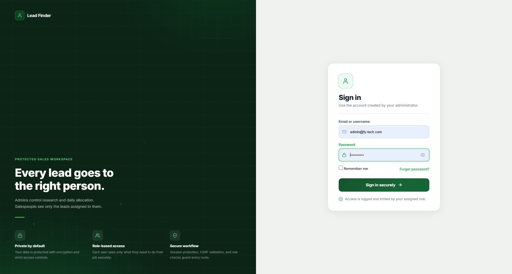
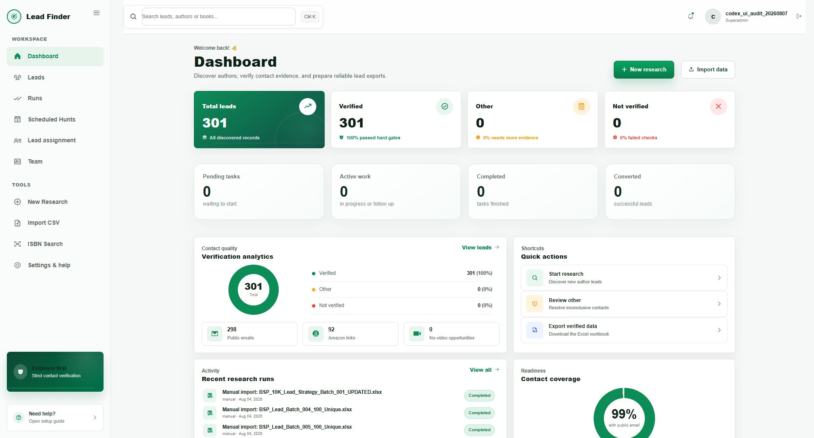
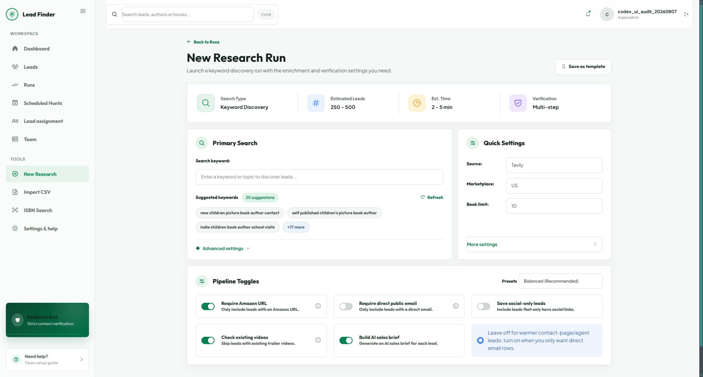
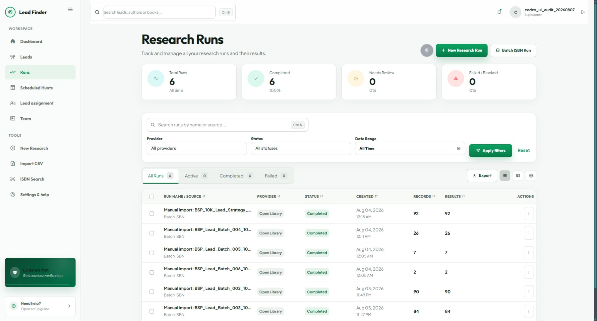
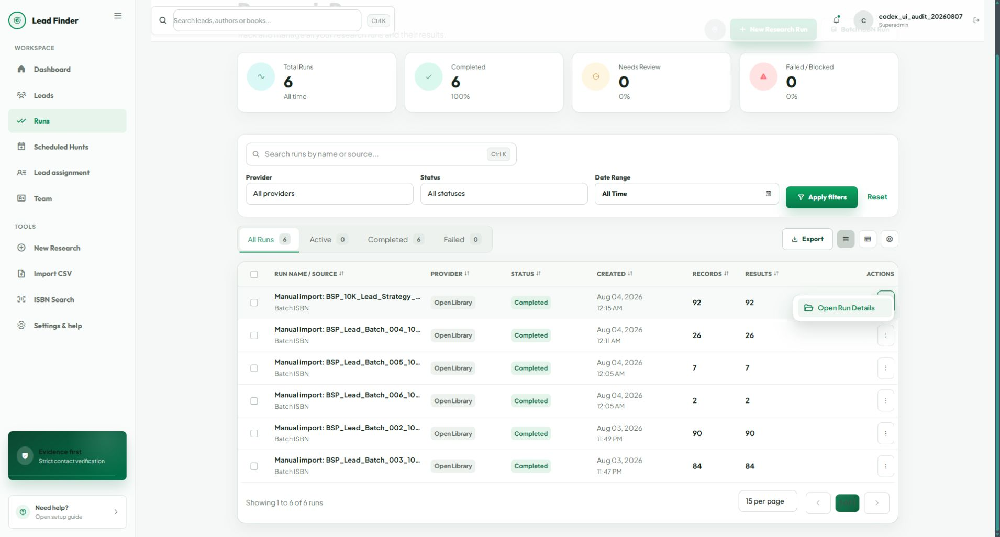

# Professional Amazon Lead Finder: Audit and Implementation Plan

**Audit date:** 2026-08-07  
**Application:** Book Trailer Lead Finder  
**Goal:** Make the product reliable, professional, free-first, easy to understand, and fast to operate without repeated `run -> runs -> menu -> detail -> lead detail` navigation.

## Implementation status (2026-08-07)

The first trust-and-flow slice is complete and verified by the full suite (`227 passed`):

- Added `EligibilityPolicy`, used by review filters, dashboard/run counts, approval, assignment, and verified-only exports.
- Changed manual imports from automatically verified/approved to uploader-attested and awaiting system verification.
- Added the explicit uploader-attestation data fields and migration `0014_lead_uploader_attestation`.
- Stopped stored API keys from rendering into settings HTML; blank secret fields preserve existing values, and settings now provide replace, remove, and local configuration-check actions.
- Made research-run names native links and exposed direct `Review N leads`, failure, and live-workspace actions.
- Restored the verified-contact marker and clarified active ISBN enrichment status.

The remaining phases in this document are still planned work: durable pipeline jobs, the live research workspace, the master-detail review queue, canonical data models, provider consolidation, and outreach hardening.

## 1. Audit scope

This plan is based on a read-through of the application-owned Markdown, Python, HTML, CSS, JavaScript, PowerShell, tests, routes, models, management commands, provider integrations, and a live authenticated desktop walkthrough.

Reviewed application surface:

- 11 application Markdown files.
- Approximately 150 Python files and 22,000 application/test lines.
- 17 templates.
- The shared CSS and JavaScript bundles.
- Discovery, enrichment, verification, scoring, assignment, outreach, export, and scheduling paths.
- The existing SQLite data and current UI routes.
- The complete test suite.

Excluded from the application audit:

- The vendored upstream Django framework source under the repository-level `django/` directory.
- Generated lead CSV data and historical output files, except where their structure affected imports or exports.
- Production infrastructure that is not present in the repository.

The live audit captured the primary entry, dashboard, research form, runs table, and the extra actions-menu step. Browser control repeatedly timed out before a stable run-detail or lead-detail capture could be accepted, so those later steps were verified from templates, views, tests, and route behavior rather than claimed as visually audited.

## 2. Executive verdict

The product has many valuable capabilities, but it currently behaves like several internal tools joined together. The operator must understand runs, commands, providers, agent stages, review states, assignments, and exports before completing the simple job of finding and approving an author lead.

The correct improvement is not a cosmetic dashboard redesign. The order must be:

1. Restore trust in verification, evidence, secrets, suppression, and exports.
2. Make background work durable and honest.
3. Replace the click-heavy navigation with one live research workspace and one review queue.
4. Consolidate providers and duplicate commands behind one application service.
5. Add professional automation, reporting, and outreach only after the qualification rules are consistent.

The target product promise should be:

> Enter a keyword, ISBN/ASIN, BookLife category, or file once; watch verified leads appear; review evidence without leaving the queue; approve, assign, and export only what is truly eligible.

## 3. Current UX evidence

### Step 1 — Sign in: healthy with one broken action



Strengths:

- Clear role-based workspace positioning.
- Labels are visible and the primary action is obvious.
- The password field has a show/hide control.

Issues:

- `Forgot password?` points to `#` and is not a real recovery flow.
- The page contains a very large inline CSS/JavaScript implementation instead of shared auth components.
- Animations need a `prefers-reduced-motion` path.

### Step 2 — Dashboard: visually strong, operationally noisy



Strengths:

- Clean hierarchy and readable summary cards.
- Primary research and import actions are visible.
- Navigation is consistent.

Issues:

- The page duplicates verification totals in cards, a chart, quick actions, and coverage panels.
- The dashboard emphasizes system summaries instead of the next operator task.
- Some displayed verification numbers are based on stored email/phone presence, not the actual contact-verification engine.
- Recent runs send the operator into a separate detail journey instead of showing the latest results inline.
- The run filenames and low-value system panels consume space that should show review-ready leads, blocked reasons, and active jobs.

### Step 3 — New Research: too many concepts before the first result



Strengths:

- Suggested keywords help first-time users.
- Important pipeline choices are visible.
- The form provides presets conceptually.

Issues:

- The screen exposes internal concepts—provider, marketplace, Amazon constraint, social-only behavior, video scan, AI brief—before the operator has selected a goal.
- The primary `Run Research` button is below the captured viewport.
- The summary promises `250–500` estimated leads while the visible book limit is `10`; the estimate is not derived from form values.
- Tavily is selected even though project documentation says DDGS is the free-first default.
- `Save as template`, `+17 more`, and preset behavior are visible but not implemented.
- Marketplace and preferred location are stored but not consistently used by discovery.
- The UI does not show expected provider calls, remaining quota, cost, or which fallbacks will be used.

### Step 4 — Runs: strong table, unnecessary destination



Strengths:

- Search, filters, statuses, counts, and pagination are easy to scan.
- Active/completed/failed grouping is appropriate for operations.

Issues:

- A separate run list is required before results can be reviewed.
- The run row is not directly openable.
- Date range, Export, Table view, Compact view, and Table settings are visible without complete behavior.
- Provider labels can be wrong when a requested paid provider silently falls back to DDGS.

### Step 5 — Open a run: confirmed extra click



The primary action is hidden behind a three-dot button and then `Open Run Details`. This exactly matches the reported time waste. A completed row should open directly, and its primary visible action should be `Review 92 leads`.

### Current journey

```text
Dashboard
  -> New Research
  -> configure internal pipeline options
  -> scroll to Run Research
  -> Run Detail / agent progress
  -> find results section
  -> Lead Detail
  -> return to table
  -> repeat for every lead
```

### Target journey

```text
Find Leads
  -> choose Quick Free / Balanced / Deep / Import
  -> enter query or identifiers
  -> Start Hunt
  -> live results appear in the same workspace
  -> open evidence drawer
  -> approve / reject / DNC / assign / next
  -> export the approved selection
```

## 4. P0 findings that must be fixed before feature expansion

### 4.1 Verification is inconsistent

- Manual imports can be saved as `verified`, score `100`, and approved even when no checks ran: `leadfinder/views.py:352`.
- The lead list and dashboard treat non-empty email/phone fields as verified-ready: `leadfinder/views.py:1014`.
- The real verifier uses source, identity, role, syntax, delivery, and corroboration checks: `leadfinder/services/verification/contact_verifier.py:103`.
- Contact verification can ignore the evidence row's own confidence while exports apply separate confidence thresholds.

Required change:

- Create one `EligibilityPolicy` service used by import, pipeline, UI stats, approval, scheduling, assignment, export, and outreach.
- Separate these facts:
  - contact text exists;
  - syntax is valid;
  - source is trusted;
  - identity matches;
  - delivery check is positive/unknown/negative;
  - a human approved it;
  - the lead is eligible for the requested action.
- Never use `verified` as a synonym for “field is not empty.”

### 4.2 API secrets are returned to the browser

- The settings page renders saved keys into password input `value` attributes: `leadfinder/templates/leadfinder/settings_help.html:47`, `:72`, `:86`, `:110`, `:123`, `:135`, `:148`, and `:159`.
- Settings are written to plaintext `.env` and mutated in the web process: `leadfinder/views.py:1789`.

Required change:

- Never render an existing secret value.
- Show only `Configured`, masked suffix, last tested time, and `Replace` / `Remove` actions.
- Keep deployment secrets in environment variables or an OS/cloud secret store.
- For local-only mode, use a permissions-restricted encrypted credential file with a separate master key outside the repository.
- Add an audit event for credential create/replace/remove/test; never log values.

### 4.3 Do-not-contact is not a global suppression rule

- `DoNotContact` exists but is not enforced as a global identity/contact suppression list: `leadfinder/models.py:688`.
- The lead action changes one row only: `leadfinder/views.py:1532`.
- Outreach does not re-check suppression, approval, verification, or campaign state immediately before send: `leadfinder/services/pipeline/outreach.py:44`.

Required change:

- Create normalized suppression keys for email, domain, canonical author, and organization.
- Check suppression during import, enrichment, assignment, campaign enrollment, export, and immediately before any send.
- Marking DNC must close or pause active assignments and campaign enrollment for the same identity.
- Store who applied the suppression, reason, scope, source, and timestamp.

### 4.4 Background runs are not durable

- Web requests launch daemon threads: `leadfinder/views.py:115`.
- A server restart can lose work.
- Per-book exceptions are caught, but a run can still be marked completed even if all books failed: `leadfinder/services/pipeline/run_research.py:627`.
- The main enrichment function is a large serial monolith: `leadfinder/services/pipeline/process_book.py`.

Required change:

- Add a database-backed `PipelineJob` and `StageAttempt` worker.
- Use row claims with `select_for_update(skip_locked)` on PostgreSQL; keep a safe single-worker fallback for SQLite development.
- Persist stage status, heartbeat, attempts, retry time, error category, provider usage, and partial results.
- Use `completed`, `completed_with_errors`, `failed`, `canceled`, and `paused` honestly.
- Make every stage idempotent so resume/retry cannot duplicate authors, contacts, evidence, videos, or outreach.

This design is free-first and does not require Redis or a paid queue. Celery/Redis can remain an optional scale-up later.

### 4.5 Network fetching needs one hardened client

- Robots checks fail open and are not cached: `leadfinder/services/crawl/robots.py:9`.
- Redirects are followed before every destination is validated: `leadfinder/services/crawl/safe_fetch.py:51`.
- DNS failures are treated as not-private, leaving redirect/DNS-rebinding risk: `leadfinder/utils/url_safety.py:38`.
- Search and page fetches do not share consistent size, MIME, timeout, retry, or per-origin rate policies.

Required change:

- Build `SafeHttpClient` with manual redirect handling.
- Validate scheme, host, DNS result, and resolved IP at every redirect hop.
- Block private, loopback, link-local, multicast, and reserved addresses.
- Enforce content type and a 2 MB default response cap.
- Cache robots rules with a TTL; use allow/deny/unknown states instead of silently treating errors as allowed.
- Add per-host concurrency, minimum delay, `Retry-After`, exponential backoff, and a circuit breaker.
- Identify the application with an honest user agent and contact address.

### 4.6 SMTP verification produces false certainty

- Temporary SMTP replies such as `450`, `451`, and `452` can be treated as deliverable: `leadfinder/services/pipeline/mx_validator.py:82`.
- DNS exceptions can fail open in lead validation.
- MX results use an unbounded process cache and can become stale.

Required change:

- Model syntax, DNS, recipient acceptance, catch-all, temporary, blocked, and unknown separately.
- Only explicit recipient acceptance may become a positive SMTP signal.
- Treat 4xx, connection blocks, greylisting, and policy failures as `unknown`/`temporary`, not verified.
- Add TTL caches and checked timestamps.
- Never claim mailbox ownership or guaranteed deliverability.

### 4.7 Amazon Creators is not implemented

- `leadfinder/services/amazon/amazon_creators_provider.py` uses indexed search plus the existing metadata fallback; it does not use `AMAZON_CREATORS_CLIENT_ID` or `AMAZON_CREATORS_CLIENT_SECRET`.
- The settings UI and `.env.example` imply an official integration exists.
- Legacy direct Amazon HTML parser code remains after an early return in `amazon_scraper.py`, creating maintenance and policy confusion.

Required change:

- Rename the current provider to `Amazon Indexed Search`.
- Remove unreachable direct-fetch/random-user-agent code after its migration value is exhausted.
- Hide Creators credentials until a real credential test and catalog client exist.
- Add an official `AmazonCreatorsCatalogProvider` only through Amazon's documented REST API.
- Store marketplace listing evidence separately from book identifiers; an ISBN/ASIN-shaped value is not proof that an Amazon listing exists.

Amazon currently documents Creators API eligibility as enrollment in the target marketplace's Associates program, registration for API access, generated credentials, and at least 10 qualifying sales in the previous 30 days. See [Amazon Creators API](https://affiliate-program.amazon.com/creatorsapi/docs/).

### 4.8 Outreach is not production-safe

The current dispatcher lacks several required controls:

- active-campaign and human-approval enforcement;
- DNC/unsubscribe enforcement;
- idempotency and row claims;
- safe distinction between retry, deferred, bounce, and permanent failure;
- daily quota reset by date;
- arbitrary campaign-step support;
- provider message IDs and content snapshots;
- a complete operator UI.

Required change:

- Keep automatic sending disabled until the transactional outbox, suppression, approval, quota, retry, and unsubscribe acceptance tests pass.
- Store secrets in a real secret store; Django signing is authenticity protection, not encryption.

### 4.9 Exports and assignments bypass consistent eligibility

- Generic exports omit score, tier, review state, and service needs despite documentation promising them.
- Representative/publicist contacts can be output without the same source checks applied to public email.
- Contact evidence can be stale because the evidence value is not always required to equal the current contact value.
- Assignments can include raw-contact, unapproved, or rejected leads under permissive defaults.

Required change:

- Exports and assignments must consume a frozen `EligibilityDecision` and exact `ContactPoint` / `EvidenceObservation` IDs.
- Default assignment eligibility: human approved, not suppressed, verified primary contact, eligible book fit, and current evidence.
- Every export must state its recipe, filters, policy version, creation time, selected count, excluded count, and exclusion reasons.

### 4.10 Visible controls are misleading or broken

Remove or implement these before further UI decoration:

- New Research: Save as template, `+17 more`, presets.
- Runs: date range, export, table/compact/settings controls.
- Leads: saved views, compact/customize controls, Generate AI Pitch.
- Lead detail: More actions.
- Login: Forgot password.
- Run detail: polling references missing elements and can stop live updates.
- ISBN: contact requirement is not wired into the lookup request; another script references a missing element.
- CSV: preview does not persist the upload; progress is simulated rather than server-backed.

## 5. Target information architecture

Use four top-level destinations.

### 5.1 Find Leads

One route: `/find/`

Source modes:

- Keyword.
- ISBN / ASIN / Amazon URL.
- File import.
- BookLife category.
- Existing records needing refresh.

Presets:

- **Quick Free** — no paid calls; low call budget; contact-page and catalog checks; no AI requirement.
- **Balanced Verified** — free sources first, then configured search provider; video check; deterministic verification; AI brief only after qualification.
- **Deep Paid** — explicit budget confirmation; deeper search and more corroboration.
- **Import Only** — preserve supplied data, stage as unverified, run only selected checks.

The operator sees goal-based controls. Provider-level details live in an expandable `Plan and cost` panel.

Primary action:

- `Start hunt` remains sticky on desktop and mobile.
- Before starting, show expected candidates, maximum requests, providers/fallbacks, estimated credits, and missing keys.

### 5.2 Review Queue

One route: `/review/`

Desktop layout:

- Left: filterable lead table.
- Right: persistent quick-view drawer.
- Sticky actions: Approve, Reject, DNC, Reverify, Assign, Previous, Next.
- Tabs: Overview, Contact, Evidence, Pitch, Activity.
- Preserve filters, selection, scroll position, and opened lead in the URL.

Mobile layout:

- Lead cards.
- Full-height detail sheet.
- Sticky bottom review actions.
- Minimum 44 x 44 px touch targets.

Queue presets:

- Needs human review.
- Verified contact, not approved.
- Missing Amazon evidence.
- No public video found in searched sources.
- Conflicting identity.
- Stale evidence.
- Ready to assign.
- Suppressed/blocked.

### 5.3 Activity

One route: `/activity/`

Combine:

- active/completed/failed research jobs;
- scheduled hunts;
- retries and dead-letter items;
- provider health and quotas;
- assignment schedule runs.

Run rows open directly. Primary completed action is `Review N leads`; primary failed action is `View failures`; active action is `Open live workspace`.

Add a persistent active-jobs tray to every screen so operators never need to navigate to Runs only to check progress.

### 5.4 Delivery

One route group: `/delivery/`

Include:

- saved export recipes;
- selected/filtered export preview;
- assignments and team capacity;
- campaign drafts and compliance approval;
- suppression management;
- provider and credential settings;
- audit log.

## 6. Live research workspace specification

After `Start hunt`, do not redirect the operator to a diagnostic-heavy page. Keep the same workspace and change the state in place.

Header:

- Job name and editable label.
- State, elapsed time, last heartbeat.
- Pause, stop, retry failed stages.
- Provider usage and estimated cost.

Compact stage timeline:

1. Discover.
2. Resolve books/listings.
3. Find author identity.
4. Find contacts.
5. Check video.
6. Verify and score.
7. Prepare review.

Each stage shows:

- pending/running/completed/partial/failed/skipped;
- attempted and successful counts;
- retry count;
- blocked reason;
- provider actually used.

Inline results table:

- New rows appear as books complete.
- Filters work while the job is active.
- Every row exposes eligibility, contact status, book fit, video status, and blocked reasons.
- `Quick view` opens evidence without a page change.
- Bulk actions show a preview: `84 eligible, 8 blocked`, with reasons before execution.

Diagnostics:

- Keep the five-agent visualization and raw thought/event log in an optional diagnostics drawer.
- Do not make internal agent orchestration the main results experience.

## 7. Provider and API strategy

### 7.1 Provider matrix

| Provider | Key | Current reality | Professional target |
| --- | --- | --- | --- |
| DDGS | No | Default no-key search; unofficial and can change or throttle | Development/low-volume fallback only; surface fallback and failures |
| Open Library | No | Exact ISBN metadata | Low-volume identified requests only; cache; use dumps for bulk |
| Library of Congress | No | Used in ISBN keyword fallback | Promote to a first-class structured metadata provider |
| BookLife | No | Robots-gated pages/indexed fallback | Keep as a bounded public discovery source with provenance |
| Google Books | `GOOGLE_BOOKS_API_KEY` | Code advertises no-key mode | Use a restricted key for documented public-data access |
| Tavily | `TAVILY_API_KEY` | Supported; defaults to advanced depth | Use basic depth by default; 1,000 free credits/month; budget advanced calls |
| Brave Search | `BRAVE_API_KEY` | Supported | Optional search fallback; show monthly free credit and usage |
| Google CSE | `GOOGLE_API_KEY` + `GOOGLE_CSE_ID` | Supported | Legacy existing customers only; plan removal before 2027-01-01 |
| YouTube Data API | `YOUTUBE_API_KEY` | Optional; client/query duplication | Shared client, cached 1–2 query plan, quota accounting |
| Groq | `GROQ_API_KEY` | Optional extraction and briefs | Run only after deterministic qualification; schema validate and budget |
| Amazon Creators | client credentials | Credentials exposed but unused | Build a real provider or remove the claim/UI entirely |

Official limits and requirements checked during this audit:

- [Open Library API guidance](https://openlibrary.org/developers/api) says its API is not a bulk/high-traffic commercial backend, asks identified requests to use a real user agent/contact, and currently documents 1 request/second unidentified or 3 requests/second identified.
- [Google Books API](https://developers.google.com/books/docs/v1/using) documents an API key or OAuth token for public-data requests. The current `No-key public mode` label should not be treated as a supported production contract.
- [Tavily pricing](https://docs.tavily.com/documentation/api-credits) currently provides 1,000 free credits/month; basic search costs 1 credit and advanced search 2.
- [Brave Search API pricing](https://api-dashboard.search.brave.com/app/plans) currently lists $5 per 1,000 search requests and $5 monthly credit.
- [Google Custom Search JSON API](https://developers.google.com/custom-search/v1/overview) is closed to new customers and scheduled for discontinuation on 2027-01-01; existing customers receive 100 free queries/day until then.
- [YouTube Data API](https://developers.google.com/youtube/v3/getting-started) uses project quotas and requires an enabled Google Cloud project/API credential.
- [Groq free-plan limits](https://console.groq.com/docs/rate-limits) vary by model and must be read from account response headers/limits rather than hardcoded.

### 7.2 Free-first query plan

For a keyword hunt:

1. Discover candidates through the selected public/indexed provider.
2. Normalize identifiers and titles.
3. Resolve exact structured metadata through Library of Congress, Google Books, and low-volume Open Library calls.
4. If Amazon evidence is required, require a real indexed Amazon product URL or official Creators API listing; never fabricate one from an ISBN.
5. Search for author-owned or authorized pages.
6. Stop contact searching when a high-confidence author-owned page and verified contact have been found.
7. Run only one bounded video query, adding a second only when the first is ambiguous.
8. Run AI extraction/briefing only for candidates that survive deterministic gates.

### 7.3 Provider response contract

Every provider call returns:

```text
requested_provider
actual_provider
fallback_chain
fallback_reason
query_fingerprint
started_at / completed_at / latency_ms
status / error_category / provider_request_id
result_count
quota_units
estimated_cost
cache_hit
```

Unavailable credentials must produce either:

- strict failure with a clear operator message; or
- an explicit fallback recorded in the run.

Never silently label DDGS results as Tavily, Brave, or Google.

## 8. Target backend architecture

### 8.1 Application services

Create thin entry adapters and one shared service layer:

```text
UI / CLI / scheduler
        |
        v
RunSpec + EligibilityPolicy + ProviderPlan
        |
        v
PipelineJob / StageAttempt worker
        |
        +--> DiscoveryService
        +--> BookResolutionService
        +--> AuthorIdentityService
        +--> ContactDiscoveryService
        +--> VideoEvidenceService
        +--> VerificationService
        +--> ScoringService
        +--> BriefService
        +--> DeliveryService
```

Management commands become thin adapters. Archive or migrate duplicate logic in `pull_tavily_validated_leads`, `scrape_author_visit_leads`, Scrapy batch commands, blog commands, and standalone import/enrichment scripts.

### 8.2 Split oversized modules gradually

Do not rewrite everything at once.

- Split `views.py` into `views/find.py`, `views/review.py`, `views/activity.py`, `views/delivery.py`, and small API modules.
- Split `process_book.py` by the stages above.
- Move page JavaScript from templates into modules.
- Replace the 12,000+ line CSS cascade with tokens, components, utilities, and page bundles.
- Keep compatibility wrappers until all callers are migrated and tested.

### 8.3 Data model additions

Additive models first:

- `AuthorIdentity` — canonical person/organization and aliases.
- `BookWork` — title-level identity.
- `BookEdition` — ISBN, publisher, publication metadata.
- `MarketplaceListing` — marketplace, ASIN, exact URL, evidence, checked time.
- `ContactPoint` — normalized email/phone/contact page/agent/publicist channel.
- `EvidenceObservation` — immutable source URL, exact field/value/span, fetch ID, confidence, observed time.
- `VerificationCheck` — check type, result, reason, provider, checked time, expiry.
- `EligibilityDecision` — action, eligible flag, reason codes, policy version, snapshot time.
- `SuppressionEntry` — DNC/unsubscribe scope and reason.
- `ScoreSnapshot` — component scores, inputs, version, explanation.
- `PitchDraft` — model/prompt/schema version, evidence anchors, draft/approved status.
- `PipelineJob`, `StageAttempt`, and `ProviderCall` — durable work and cost/provenance.
- `SavedView`, `RunTemplate`, and `ExportRecipe` — real behavior for currently decorative controls.

Important constraints:

- unique marketplace + ASIN when ASIN evidence exists;
- unique normalized contact type + value;
- stage idempotency key;
- evidence fingerprint;
- one active assignment per lead and no assignment for suppressed/blocked identity;
- one outbox message per campaign enrollment + step idempotency key.

### 8.4 Lead lifecycle

Show one operator-facing lifecycle:

```text
Discovered
  -> Enriched
  -> Contact verified
  -> Human approved
  -> Assigned
  -> Contacted
```

Side states:

- Needs review.
- Blocked.
- Rejected.
- Suppressed.
- Stale.

Do not derive lifecycle from score alone. Every transition stores actor, time, reason, policy version, and relevant evidence IDs.

## 9. Verification, scoring, and AI plan

### 9.1 Verification policy

Create explicit action policies:

- `reviewable`.
- `approvable`.
- `assignable`.
- `exportable`.
- `campaign_enrollable`.
- `sendable_now`.

Each policy returns reason codes, for example:

```text
missing_amazon_evidence
book_fit_uncertain
identity_below_threshold
contact_not_source_backed
smtp_temporary_unknown
human_approval_required
suppressed_email
stale_contact_check
existing_trailer_found
```

The UI must display these reasons directly.

### 9.2 Scoring

Replace one opaque score with stored components:

- book fit;
- visual/trailer opportunity;
- contactability;
- identity confidence;
- evidence quality/freshness;
- campaign fit;
- compliance risk.

Rules:

- Unknown is not automatically an opportunity.
- Rating is not evidence of cover, illustration, editing, or marketing quality.
- A missing website/A+ field is not automatically a service need.
- Use parsed registered-domain equality, not substring matching.
- Store score version and component explanation.
- Human review and verification inputs must affect eligibility even when they do not change the commercial fit score.

### 9.3 AI

- Validate every Groq result with Pydantic schemas.
- Build bounded field-level context; do not slice serialized JSON into invalid content.
- Recompute final identity/contact decisions from programmatically accepted evidence, never the model's self-reported confidence alone.
- Store prompt/model/schema version and evidence anchors.
- Draft pitches may use only confirmed facts.
- Remove unsupported praise such as “loved the visual style” unless a human actually supplied it.
- Require human approval before campaign enrollment.

## 10. UI component and accessibility plan

Shared components:

- `StatusBadge`.
- `LifecycleBadge`.
- `ProviderCard`.
- `ProviderPlanSummary`.
- `FilterBar`.
- `DataTable`.
- `JobProgress`.
- `EvidenceList`.
- `LeadQuickView`.
- `EligibilityReasons`.
- `StickyReviewBar`.
- `BulkActionPreview`.
- `EmptyState`.
- `ErrorState`.

Accessibility requirements:

- Native links for rows; no mouse-only `onclick` rows.
- Keyboard-openable quick view and menus.
- Proper tablist/tab/tabpanel semantics.
- Visible focus indicators.
- `aria-live` for job state changes and an actual progressbar where progress is measurable.
- Labels and instructions connected to controls.
- 44 x 44 px minimum touch targets for primary mobile actions.
- Color is never the only status signal.
- `prefers-reduced-motion` support.
- `rel="noopener noreferrer"` for external blank-target links.
- Test at 320, 375, 768, 1024, 1280, and 1440 widths plus 200% zoom.

## 11. Detailed implementation phases

### Phase 0 — Baseline and guardrails (2–3 days)

Deliverables:

- Back up the database and document rollback.
- Record current route, model, provider, command, and export contracts.
- Freeze a representative sanitized fixture set.
- Add feature flags for new eligibility, job worker, review UI, and provider plan.
- Repair the current two failing tests before relying on the suite as a gate.
- Add a test that fails when a full secret appears in settings HTML.

Exit criteria:

- `manage.py check` clean.
- migrations dry-run clean.
- full tests green.
- no secrets or real contact data in fixtures/logs.

### Phase 1 — Trust, security, and correctness (1–2 sprints)

Work:

- Implement `EligibilityPolicy` and reason codes.
- Change manual import default to staged/unverified.
- Add uploader-attested status separate from system verification.
- Fix UI/dashboard verification filters and counts.
- Hide stored API keys and add replace/remove/test actions.
- Implement global suppression and DNC propagation.
- Fix SMTP temporary/unknown behavior and TTLs.
- Make evidence matching require exact current contact values.
- Fix approval override semantics and audit overrides.
- Correct safe video wording everywhere.
- Disable production outreach until sendability gates pass.
- Remove false KPI deltas and false “Official Creator” / “above average” claims.

Exit criteria:

- The same lead has the same eligibility result in UI, scheduler, assignment, export, and outreach.
- An unchecked import cannot appear as verified or approved.
- A suppressed contact cannot be assigned, exported for outreach, enrolled, or sent.
- No API secret is returned in HTML, logs, exports, or error messages.

### Phase 2 — Durable jobs and provider provenance (1–2 sprints)

Work:

- Add `PipelineJob`, `StageAttempt`, `ProviderCall`, claims, heartbeat, retry, cancellation, and partial completion.
- Replace daemon threads with a managed database worker.
- Add `SearchResponse`/provider call contract.
- Stop silent provider fallback; expose requested and actual provider.
- Add per-run quotas, estimated credits, and hard budgets.
- Use Tavily basic depth by default.
- Consolidate YouTube client and reduce duplicate queries.
- Move caches to a shared database-backed implementation with TTL, pruning, provider/schema version, and negative caching.
- Harden HTTP/robots/redirect behavior.

Exit criteria:

- Restarting the web server does not lose a job.
- A failed stage resumes without duplicate records.
- All-books-failed becomes `failed` or `completed_with_errors`, never completed-success.
- Every provider result states its actual source, fallback reason, latency, and usage.

### Phase 3 — One-screen Find Leads experience (1–2 sprints)

Work:

- Build `/find/` with keyword, identifier, import, BookLife, and refresh modes.
- Implement Quick Free, Balanced Verified, Deep Paid, and Import Only presets.
- Add sticky `Start hunt` and honest plan/cost preview.
- Keep the operator in the live workspace after submit.
- Stream/poll real server-backed stage progress and inline results.
- Add active-jobs tray globally.
- Make run rows directly openable with visible outcome actions.
- Implement real run templates and schedules or remove the controls until ready.
- Persist CSV preview safely so re-selection is unnecessary.

Exit criteria:

- A first-time operator can start a free hunt without understanding provider internals.
- Start-to-first-result does not require a navigation to Runs or Run Detail.
- Active, failed, partial, stopped, and completed states are understandable and accessible.

### Phase 4 — Review Queue and evidence workflow (1–2 sprints)

Work:

- Build split-pane `/review/`.
- Add previous/next and keyboard navigation.
- Add inline approve, reject, DNC, reverify, assign, and note actions.
- Preserve filters, selection, and scroll.
- Add exact evidence source, snippet/span, checked time, verification checks, and expiry.
- Add bulk action preview with eligible/blocked counts and reasons.
- Add saved views backed by real models.
- Add source freshness and scheduled reverification.

Exit criteria:

- A reviewer can process 20 consecutive leads without leaving the queue.
- Every approval or block is explainable from visible evidence.
- Bulk actions cannot silently skip or include records; preview and result totals reconcile.

### Phase 5 — Canonical data, scoring, and exports (2–3 sprints)

Work:

- Add canonical author/work/edition/listing/contact models.
- Backfill aliases and cross-run dedupe candidates.
- Add a human merge queue for ambiguous duplicates.
- Add unique constraints after cleanup.
- Introduce versioned score snapshots and component explanations.
- Add schema-validated evidence-anchored pitch drafts.
- Build export recipe registry and exact qualification snapshots.
- Escape CSV/Excel formula injection.
- Include score, tier, review state, policy version, contact/evidence IDs, and reasons.

Exit criteria:

- Re-running or re-importing the same author/book/contact does not create outreach duplicates.
- Exported contacts exactly match their evidence and eligibility snapshot.
- A historical export can be reproduced and explained.

### Phase 6 — Delivery, assignments, and safe outreach (2–3 sprints)

Work:

- Make approved/verified/not-suppressed the assignment default.
- Add team capacity, SLA, recycle rules, and assignment reason preview.
- Implement campaign/sender/enrollment UI only after policy gates.
- Add transactional outbox and idempotency keys.
- Add arbitrary campaign steps, dated quotas, provider message IDs, content snapshot, retry/deferred/bounce states, unsubscribe, and global suppression.
- Move SMTP/IMAP/API credentials to a secret store.
- Require compliance and pitch approval.

Exit criteria:

- Concurrent workers cannot send the same step twice.
- Paused/draft campaigns cannot send.
- DNC/unsubscribe blocks immediately.
- Every send has an approved content snapshot and traceable message ID.

### Phase 7 — UI refactor, production readiness, and analytics (1–2 sprints)

Work:

- Introduce design tokens and shared component CSS.
- Move template-local scripts/styles into tested modules.
- Delete superseded CSS layers and reduce `!important` usage.
- Add PostgreSQL deployment, backups, structured logging, health checks, and worker supervision.
- Add data retention, deletion, and export policies.
- Add dashboards for source yield, cost per approved lead, verification sample precision, stale evidence, bounce/opt-out, assignment SLA, and conversion.
- Update every Markdown source of truth to match behavior.

Exit criteria:

- Responsive and accessibility checks pass at supported breakpoints.
- Operational metrics distinguish volume from quality.
- Documentation, settings labels, and runtime behavior agree.

## 12. File-level change map

| Area | Current files | Target change |
| --- | --- | --- |
| Entry views | `leadfinder/views.py` | Extract find/review/activity/delivery views and small JSON endpoints |
| Forms | `leadfinder/forms.py` | Goal-based `RunSpec` form, provider-plan validation, real presets |
| Pipeline | `services/pipeline/run_research.py`, `process_book.py` | Durable stages, idempotency, early stop, honest completion |
| Verification | `quality_gate.py`, `lead_validator.py`, `contact_verifier.py`, `mx_validator.py` | One policy and tri-state checks |
| Search | `services/search/*` | Registry, typed response, fallback provenance, quotas, health |
| Amazon | `services/amazon/*` | Indexed-search rename; official Creators provider; remove dead direct parser |
| Books | `services/books/*` | Exact multi-source reconciliation and structured provider registry |
| Crawl | `services/crawl/*`, `utils/url_safety.py` | Shared hardened client, robots cache, redirect validation |
| Models | `leadfinder/models.py` + migrations | Add canonical identity, evidence, job, policy, suppression, recipe models |
| UI | `templates/leadfinder/*` | Find workspace, review split pane, direct row actions, honest copy |
| Assets | `static/leadfinder/app.css`, `app.js` | Tokens/components/modules; remove accumulated override eras |
| Settings | `settings_help.html`, settings view | Never echo secrets; provider test/health/quota cards |
| Export | `services/export/*`, export commands | Recipe registry, qualification snapshot, exact evidence IDs |
| Outreach | `services/pipeline/outreach.py`, campaign models | Keep disabled until transactional outbox and suppression pass |
| Tests | `leadfinder/tests/*` | Policy matrix, job recovery, provider contracts, E2E, accessibility, responsive |
| Docs | README, walkthrough, agent DNA, env example | Update with each behavior change; remove unsupported claims |

## 13. Test plan

### Unit tests

- Eligibility decision matrix across all contact/book/video/review/DNC states.
- SMTP response classification.
- Exact evidence/contact matching.
- Score component/version behavior.
- Provider fallback and budget behavior.
- Amazon listing evidence vs identifier syntax.
- Suppression key normalization.

### Integration tests

- Import -> staged lead -> verify -> approve -> export.
- Keyword hunt -> partial provider failure -> completed with errors -> retry only failed stages.
- Server restart -> worker reclaims stale job without duplicates.
- DNC -> active assignment/enrollment paused -> export/send blocked.
- Provider key missing/invalid/quota exhausted -> visible fallback or strict failure.
- Duplicate author/book/contact across runs -> canonical reuse/merge queue.
- Exact export rows reconcile with filter, selection, evidence, and policy snapshot.

### End-to-end UI tests

- Find -> live progress -> inline result -> quick view -> approve -> next -> export.
- Keyboard-only review and menu navigation.
- Mobile sticky CTA and review bar.
- Job tray across routes.
- Dead-control regression test.
- Settings HTML contains no stored secret.
- Error, empty, partial, offline, timeout, and stale states.

### Security tests

- Redirect SSRF and DNS rebinding fixtures.
- Private/reserved IP blocking.
- Response size/MIME limits.
- CSV formula injection.
- Secret redaction.
- Role/tenant visibility.
- DNC/unsubscribe race immediately before send.
- Concurrent job claims and outbox idempotency.

### Performance budgets

- Dashboard and review queue database query counts.
- First useful result time.
- Requests per accepted lead.
- Provider credits per approved lead.
- Early-stop effectiveness.
- 700-candidate memory/DB behavior without loading all records into one process.

## 14. Migration and rollout

Use additive, reversible migration steps.

1. Add new models and policy snapshots without removing current fields.
2. Dual-write old and new evidence/contact/job structures.
3. Backfill canonical identities and detect conflicts.
4. Run old and new eligibility in shadow mode; compare results.
5. Review false-positive/false-negative samples.
6. Switch dashboard/review/export to the new policy behind a feature flag.
7. Switch worker orchestration.
8. Remove old paths only after callers, tests, commands, and docs are migrated.

Never silently delete historical evidence. Keep source observations immutable and record corrections as newer observations/decisions.

## 15. Success metrics

Primary product metrics:

- Median clicks from start to first reviewed lead: target 2–3 after entering input.
- Median leads reviewed without leaving the queue: target 20+.
- Percentage of exported contacts with exact evidence and current eligibility snapshot: target 100%.
- Duplicate outreach identities in an export/campaign: target 0.
- Jobs lost by web restart: target 0.
- Silent provider fallbacks: target 0.
- Secrets rendered to browser/logs: target 0.

Quality metrics:

- Sampled contact precision by source/provider.
- Identity mismatch rate.
- Temporary/unknown SMTP rate; never hide as positive.
- Evidence freshness.
- Approved leads per 100 provider requests/credits.
- Bounce, opt-out, complaint, and DNC rates if outreach is later enabled.

## 16. Recommended first implementation slice

Start with one small but meaningful vertical slice:

1. Add `EligibilityPolicy` and reason codes.
2. Stop auto-verifying unchecked imports.
3. Make dashboard/list verification counts use the policy.
4. Hide all stored API key values.
5. Make each run row a native link and show `Review N leads` directly.
6. Add a lead quick-view drawer with Approve, Reject, DNC, and Next.
7. Fix the two failing tests and add policy/secret/navigation regression tests.

This slice immediately improves trust and removes the most visible time waste without waiting for the full data-model and worker migration.

## 17. Evidence limits

- Screenshots confirm the dashboard, new-research layout, run list, and extra run-actions click at the current desktop viewport.
- Code confirms later run/lead flows and accessibility risks, but unstable browser control prevented accepted screenshots of those later pages in this audit.
- Screenshot review cannot prove full WCAG compliance; keyboard, screen-reader, contrast, zoom, and responsive checks must be run during implementation.
- External provider limits and pricing can change; the application must test provider health and read quota headers rather than permanently hardcoding marketing-plan values.
